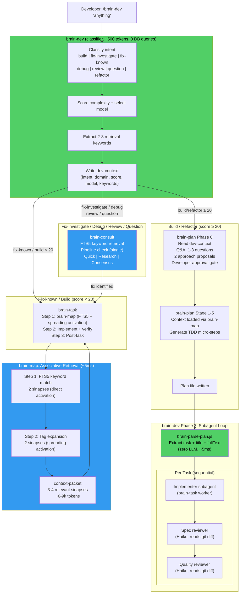

# ForgeFlow Mini

Brain-driven development plugin for Claude Code -- persistent knowledge that learns from every task, dispatches subagents for speed, and protects quality with hooks and circuit breakers.

<p align="center">
  
  
  
  
  
</p>

**Every task builds the brain.** ForgeFlow maintains a persistent knowledge system that remembers architecture patterns, learns from failures, and routes tasks to the right model. Knowledge compounds across sessions -- the 50th task runs smarter than the first.

**Intelligent routing with subagent dispatch.** Describe what you need. brain-dev classifies complexity (0-100), selects the optimal model (Haiku/Sonnet/Codex/Opus), and dispatches to subagents for speed and token efficiency. Sonnet tasks run as isolated subagents (76% main context savings). Complex tasks run inline with full context.

**Self-contained pipeline. Hooks enhance, never drive.** The pipeline works for any user, first time, with zero hooks configured. Nine optional hooks add guardrails (hippocampus guard, config protection), resilience (strategy rotation, circuit breaker), and lifecycle management (session state persistence).

**Failure becomes knowledge automatically.** When something breaks, brain-task captures an episode. brain-consolidate processes episodes into sinapse updates (developer-approved). Recurring patterns (3+ occurrences) get proposed as conventions. The brain learns from mistakes without manual intervention.

---

## Quickstart

```bash
# Terminal (not inside a Claude Code session):
claude plugin marketplace add https://github.com/leandrotcawork/forgeflow-mini.git
claude plugin install brain-mini@forgeflow-plugins

# Then inside Claude Code:
/brain-init
/brain-task "Add dark mode toggle"
```

brain-init scans your project, generates hippocampus (architecture + conventions) and cortex (domain knowledge), optionally installs hooks (tiered: minimal/standard/strict), builds the SQLite index, and initializes state files.

<details>
<summary>Troubleshooting: skills don't show up</summary>

- Use **forward slashes** in settings.json paths (even on Windows)
- Verify files exist: `ls ~/.claude/plugins/forgeflow-mini/skills/`
- Restart Claude Code completely (not just reload)
- Check that `auto_load: true` is set

</details>

---

## Which Skill?

| I want to... | Use | What happens |
|---|---|---|
| **Start anything** | `/brain-dev [anything]` | Classifies request, evaluates brain knowledge, routes to brain-plan/brain-consult/brain-task. Primary daily entry point. |
| Build a feature | `/brain-task "description"` | Routes, loads context, dispatches subagent or implements inline, reviews |
| Debug something stuck | `/brain-task --debug "description"` | Routes to Opus for root cause analysis |
| Plan before building | `/brain-task --plan "description"` | Architecture plan with developer approval gate |
| Quick trivial fix | `/brain-task "fix typo in header"` | Auto-routes to Haiku (lightweight, inline) |
| Verify implementation | `/brain-verify` | 6-phase check: build, types, lint, tests, security, diff |
| Define success criteria | `/brain-eval` | Write capability + regression evals before coding |
| Check brain health | `/brain-status` | Staleness, coverage gaps, circuit breaker, subagent stats |
| Review completed work | `/brain-consolidate` | Batch-review sinapses, surface escalations, update weights |
| Strategic decision | `/brain-mckinsey "monolith vs microservices"` | Parallel research subagents + scoring framework |
| Ask a question | `/brain-consult "how should I..."` | Loads brain context, answers with sinapses/lessons, optionally researches docs or gets Codex opinion |
| Initialize new project | `/brain-init` | Scans project, generates brain, installs hooks |
| Upgrade from older version | `/brain-init --upgrade` | Adds v0.7.0 features (FTS5, consult-log) without full re-init |
| Configure Brain settings | `/brain-setup [section]` | Interactive wizard — browse, edit, validate, and diff brain.config.json sections |

---

## Usage Examples

### Example 1: Starting a New Project

```
> /brain-init

[Brain] Scanning project...
  Language: TypeScript (Next.js)
  Structure: monorepo (apps/web, apps/api, packages/shared)
  Tests: Jest + Playwright
  Linting: ESLint + Prettier

[Brain] Generating hippocampus...
  architecture.md -- project structure, tech stack, data flow
  conventions.md  -- naming rules, import order, error handling patterns
  strategy.md     -- product goals, current phase

[Brain] Generating cortex...
  cortex/backend/  -- 4 sinapses (auth, API routes, middleware, DB access)
  cortex/frontend/ -- 3 sinapses (components, state management, routing)
  cortex/database/ -- 2 sinapses (schema patterns, migration conventions)

[Brain] Building brain.db (SQLite + FTS5 indexes)...
  9 sinapses indexed, 0 lessons, 0 links
  FTS5 virtual tables: sinapses_fts, lessons_fts

[Brain] Install hooks? (minimal/standard/strict/skip): standard
  Installed 6 hooks (Tier 1 + 2)

Ready. Use /brain-task to start building.
```

### Example 2: Building a Feature

```
> /brain-task "Add Mercado Livre product listing API integration"

[Brain] Decision: score 45 (backend, medium risk, feature)
  Model: Codex (inline + parallel review)
  Plan mode: no (score < 50)

[Brain] Loading context...
  Tier 1: architecture + conventions + 3 lessons
  Tier 2: 5 backend sinapses (auth, API routes, adapters, error handling, outbox)
  Tokens: ~18k context loaded

[Brain] Implementing inline...
  Created: apps/api/src/modules/mercadolivre/adapter.ts
  Created: apps/api/src/modules/mercadolivre/types.ts
  Modified: apps/api/src/modules/mercadolivre/routes.ts

[Brain] Verification (6-phase)...
  Build: pass | Types: pass | Lint: pass | Tests: pass | Security: pass | Diff: clean

[Brain] Task complete: 2026-03-27-ml-product-listing
  Files: 3 created, 1 modified
  Tokens: ~42k total
```

### Example 3: Asking Questions During Implementation (brain-consult)

While implementing a feature, you hit a problem. Instead of raw conversation (no brain context) or full `/brain-task` (overkill for a question), use `/brain-consult`:

```
> /brain-consult "Why is the Mercado Livre API returning 401 on product listing?"

[Brain] Consult (research) | Domain: backend | Loading context...

The 401 error is likely caused by token expiration. Per your conventions
([[hippocampus-conventions]]), all external API adapters must implement
token refresh logic.

Per [[sinapse-backend-auth]]: your project uses the adapter pattern for
external APIs. The ML SDK uses OAuth2 with 6-hour token expiry.

From documentation (Context7: mercadolibre-sdk):
- Access tokens expire after 6 hours
- Use POST /oauth/token with grant_type=refresh_token
- Store refresh tokens securely (env var, not DB)

Note: [[lesson-00042]] warns that hardcoding token expiry leads to
race conditions -- use the SDK's built-in refresh interceptor instead.

---
Brain context: Tier 1+2 (3 sinapses, 2 lessons) + 1 external lookup
```

**Follow-up question (same thread, automatic context reuse):**

```
> /brain-consult "What about rate limiting for the ML API?"

[Brain] Consult (research) | Domain: backend | Thread: continuing...

[Uses prior thread context -- no need to re-explain what ML API is]

The ML API enforces per-app rate limits. From documentation:
- 10,000 requests/hour for certified apps
- Implement exponential backoff with jitter
- Use the X-RateLimit-Remaining header to preemptively throttle

Per [[sinapse-backend-adapters]]: your adapter base class already has
a retryWithBackoff() utility. Use it in the ML adapter.

---
Brain context: Tier 1A (thread reuse) + 1 external lookup
```

**Getting a second opinion from Codex:**

```
> /brain-consult --consensus "Should we use the official ML SDK or build a raw HTTP client?"

[Brain] Consult (consensus) | Domain: backend | Models: Claude + Codex

### Claude Assessment (with brain context)
Use the official SDK. Per [[sinapse-backend-adapters]], your project
standardizes on official SDKs when available. The ML SDK handles
OAuth2 refresh, rate limiting, and pagination automatically.

### Codex Assessment
Recommends the official SDK as well, but flags that the SDK's TypeScript
types are incomplete for the /items endpoint. Suggests using the SDK
with a thin type-extension layer for missing fields.

### Synthesis
- Agreement: use the official SDK (maintenance, auth handling, community support)
- Divergence: Codex flags incomplete types that Claude didn't catch
- Recommendation: use SDK + extend types for /items endpoint

---
Brain context: Tier 1+2 (3 sinapses, 1 lesson) | Consensus: aligned with nuance
```

### Example 4: Debugging

```
> /brain-task --debug "Product listing returns empty array but ML API shows products"

[Brain] Decision: score 30 + debugging override -> Opus
  Model: Opus (full codebase access for root cause analysis)

[Brain] Loading debug context...
  Tier 1+2: architecture, conventions, 3 lessons, 5 backend sinapses
  Error context: empty array return, expected products

[Brain] Root cause analysis...
  Found: MLAdapter.listProducts() maps response.results but ML API
  returns response.body.results (nested one level deeper)

  Fix: apps/api/src/modules/mercadolivre/adapter.ts:47
  - return response.results.map(mapProduct)
  + return response.body.results.map(mapProduct)

[Brain] Verification: all 6 phases pass
[Brain] Lesson captured: lesson-00043 "ML API response nesting" (confidence 0.3)
```

### Example 5: Strategic Architecture Decision

```
> /brain-mckinsey "Should we cache ML product data locally or always fetch live?"

[Brain] McKinsey Layer -- Strategic Analysis

Internal Scoring:
  Business Impact: 8/10 (reduces API costs, improves response times)
  Tech Risk: 4/10 (cache invalidation is manageable)
  Effort: 6/10 (Redis setup + TTL logic)
  Strategic Alignment: 9/10 (aligns with performance targets)
  Composite: 7.2/10

External Research (3 parallel subagents):
  - ML API rate limits: 10k/hour, caching reduces pressure
  - Industry practice: TTL cache (15-30 min) is standard for marketplace data
  - ML webhook support: available for price/stock changes (push invalidation)

3 Alternatives:
  A. Redis TTL cache (15 min) + webhook invalidation [Recommended, score 8.1]
  B. In-memory cache (5 min) -- simpler but no persistence [score 6.4]
  C. Full sync with local DB -- maximum speed but complex [score 5.8]

Recommendation: Option A. Redis TTL cache with ML webhooks for
real-time price/stock invalidation. 15-min TTL for catalog data.
```

### Example 6: Checking Brain Health

```
> /brain-status

Brain Status -- my-ecommerce-app

Region           | Sinapses | Avg Weight | Last Updated | Status
-----------------+----------+------------+--------------+-----------
hippocampus      | 5        | 0.87       | 2026-03-27   | healthy
cortex/backend   | 6        | 0.78       | 2026-03-27   | healthy
cortex/frontend  | 3        | 0.71       | 2026-03-25   | healthy
cortex/database  | 2        | 0.62       | 2026-03-22   | stale (5d)
cortex/infra     | 1        | 0.45       | 2026-02-10   | very stale (45d)

Circuit Breaker: closed (normal)
Subagent Usage: Haiku 12/12 success, Sonnet 5/6 (1 fallback)

Consultation Activity:
  Total: 23 (Quick: 15, Research: 7, Consensus: 1)
  Active threads: 1 (backend, last: 3 min ago)

Pending: 1 escalation proposal, 2 stale regions need attention
```

### Example 7: Consolidation Cycle

After completing several tasks, review and promote knowledge:

```
> /brain-consolidate

[Brain] Consolidation Cycle #3

Inventory: 6 tasks completed since last consolidation
  - 2026-03-27-ml-product-listing (success, Codex)
  - 2026-03-27-ml-auth-refresh (success, Sonnet)
  - 2026-03-27-ml-debug-empty-array (success, Opus)
  - 2026-03-27-ml-pagination-guard (success, Sonnet)
  - 2026-03-27-ml-rate-limiter (success, Sonnet)
  - 2026-03-27-ml-cache-setup (success, Codex)

Sinapse Updates Proposed: 3
  [1] cortex/backend/adapters.md -- add ML adapter patterns [y/n/m]: y
  [2] cortex/backend/auth.md -- add OAuth2 refresh pattern [y/n/m]: y
  [3] sinapses/caching.md -- new cross-cutting cache pattern [y/n/m]: y

Escalation Proposal:
  3 lessons share pattern: "ML API response format gotchas"
  (lesson-00042, 00043, 00044)
  Promote to convention? [y/n]: y
  -> Added to hippocampus/conventions.md

Consolidation complete:
  3 sinapse updates approved
  1 convention promoted (confidence 1.0)
  6 task artifacts archived
  Brain.db: 3 sinapses reweighted (+0.02 freshness boost)
```

### Example 8: Quick Pipeline Interrupt (brain-consult)

Mid-task, you need to ask something unrelated. Use `/brain-consult` — it automatically detects active pipelines and appends a resume reminder:

```
[Brain-task running Step 3 for task 2026-03-27-ml-cache...]

> /brain-consult "What's our Redis connection string format?"

[Brain] Consult (quick) | Domain: infra | Loading context...

It's in .env as REDIS_URL=redis://host:port/db

---
⚠️  Brain pipeline active: Task 2026-03-27-ml-cache paused at Step 3.
Resume when ready: /brain-task --resume
```

### Example 9: Configuring Brain Settings

```
> /brain-setup hooks

[Brain Setup] Section: hooks

Current values:
| Setting            | Value    | Description                    |
|--------------------|----------|--------------------------------|
| profile            | standard | Hook tier (minimal/standard/strict) |
| individual_overrides | {}     | Per-hook enable/disable        |

Change a setting? (enter key name or 'done'): profile
New value: strict
  Before: standard
  After:  strict
  This adds the activityObserver hook (Tier 3).
  Apply? [y/n]: y

Updated. Change logged to activity.md.
```

### When to Use What -- Decision Flowchart

```
You want to...
    |
    +-- Ask a question? ---------> /brain-consult "question"
    |   |                            Quick: "remind me how we..."
    |   |                            Research: "why is this error..."
    |   |                            --consensus: "which approach..."
    |   |
    |   +-- Mid-pipeline? -------> /brain-consult
    |
    +-- Build/fix/implement? ----> /brain-task "description"
    |   |                            Auto-routes by complexity (Haiku/Sonnet/Codex/Opus)
    |   |
    |   +-- Need a plan first? --> /brain-task --plan "description"
    |   +-- Debugging? ---------> /brain-task --debug "description"
    |
    +-- Strategic decision? -----> /brain-mckinsey "decision"
    |                               Parallel research + scoring framework
    |
    +-- Review brain state? -----> /brain-status (health dashboard)
    |                               /brain-consolidate (batch review + promote)
    |
    +-- Verify code quality? ----> /brain-verify (6-phase check)
    |                               /brain-eval (define success criteria)
    |
    +-- Configure? --------------> /brain-setup [section]
    |                               /brain-init (first time or upgrade)
```

---

## How It Works

### The Pipeline

Every task flows through a self-contained pipeline. No hooks required -- hooks enhance when present.



### Subagent Dispatch

brain-task dispatches work to model-appropriate subagents when it saves tokens:

| Score | Model | Execution | Why |
|---|---|---|---|
| 0-19 | Haiku | Inline | Too small for subagent overhead |
| 20-39 | Sonnet | **Subagent** | 76% main context savings, isolated execution |
| 40-74 | Codex | Inline + parallel review/doc subagents | Complex tasks need full context |
| 75+ | Codex + Plan | Inline + parallel research subagents | Architecture needs maximum context |
| Debugging | Opus | Inline | Debugging requires full codebase access |

Subagents get full context inlined in their prompt (not file references). Every subagent path has an inline fallback.

### Intelligent Routing

brain-dev scores every task on a 0-100 complexity scale:

- **Domain**: cross-domain +30, backend +10
- **Risk**: critical +35, high +20, medium +5
- **Type**: architectural +20, debugging +15, unknown_pattern +10
- **Base**: 15

### Three-Tier Context Loading

| Tier | Tokens | Content | When |
|---|---|---|---|
| Tier 1 | ~4k | Hippocampus (condensed) + top 3 lessons + task | Always |
| Tier 2 | ~10-15k | Domain sinapses (top 5) + cross-cutting + backlinks | Standard + Codex + Opus |
| Tier 3 | ~5k | Deep linked sinapses | Only if complexity >= 75 |
| Lightweight | ~4k | Tier 1 only | Haiku tasks |

### Resilience

| Feature | How It Works |
|---|---|
| **Circuit Breaker** | 3 failures in 10 min -> OPEN (5-min cooldown) -> HALF-OPEN (probe) -> CLOSED |
| **Strategy Rotation** | After 2 failures: default -> alternative -> minimal -> escalate -> human |
| **State Persistence** | brain-state.json (session) + brain-project-state.json (project), survives compaction |
| **Context Pressure** | Tracks usage: <50% low, 65% moderate, 75% high (skip optional steps), 80% critical |
| **Script Delegation** | Mechanical operations (state updates, file archival, verification) run as Node.js/Bash/Python scripts. LLM focuses on reasoning. ~3k tokens saved per task. |

### Hooks (Optional, 3 Tiers)

Hooks never drive workflow -- they add guardrails, observation, and lifecycle management.

| Tier | Profile | Hooks |
|---|---|---|
| 1 | `minimal` | Session briefing, hippocampus guard, config protection, session end |
| 2 | `standard` | + Strategy rotation, quality gate, task safety net |
| 3 | `strict` | + Activity observer |

Set via `BRAIN_HOOK_PROFILE` env var or `brain.config.json`. Disable individual hooks via `BRAIN_DISABLED_HOOKS`.

### Learning Loop

```
Task fails -> brain-task auto-captures episode -> brain-consolidate proposes sinapse update -> developer approves -> knowledge persists in sinapse
                    |
              Same pattern seen again (3+ occurrences)
                    |
              brain-consolidate generates escalation proposal
                    |
              Developer approves -> hippocampus/conventions.md
```

---

## Architecture

### Brain Directory Structure

```
.brain/
+-- hippocampus/           Constitution -- architecture, conventions, strategy
+-- cortex/                Domain knowledge -- sinapses + domain-local lessons
|   +-- backend/
|   +-- frontend/
|   +-- database/
|   +-- infra/
+-- sinapses/              Cross-cutting knowledge flows
+-- working-memory/        Ephemeral task artifacts + brain-state.json + consult-*.json
+-- progress/              activity.md + consult-log.md + brain-health.md + brain-project-state.json
+-- brain.db               SQLite index (sinapses + lessons + links + state + FTS5)
```

### Skill Map (14 Skills)

| Skill | Type | Purpose |
|---|---|---|
| `brain-dev` | Router | Primary entry point — classifies ANY request (~500 tokens, 0 DB), extracts retrieval keywords, routes to brain-plan/brain-consult/brain-task. |
| `brain-map` | Context | Loads 3-tier weighted sinapses from brain.db |
| `brain-task` | Orchestrator | Dispatches subagents or implements inline, manages pipeline |
| `brain-plan` | Planner | Cortex-Linked TDD planner — micro-steps, sinapse linking, file design, self-review gates |
| `brain-codex-review` | Reviewer | Quality gate (runs as Sonnet subagent for Codex tasks) |
| `brain-document` | Documenter | Proposes sinapse updates (Haiku subagent for simple tasks) |
| `brain-consolidate` | Curator | Batch review, escalation proposals, weight updates |
| `brain-mckinsey` | Strategist | Parallel research subagents + scoring framework |
| `brain-status` | Dashboard | Health metrics (runs as Haiku subagent) |
| `brain-init` | Initializer | Scans project, generates brain, installs hooks |
| `brain-verify` | Verifier | 6-phase verification: build, types, lint, tests, security, diff |
| `brain-eval` | Evaluator | Define success criteria before implementation |
| `brain-consult` | Consultant | Brain-informed Q&A — 3 modes (Quick/Research/Consensus), FTS5 retrieval, threading |
| `brain-setup` | Configurator | Interactive wizard for brain.config.json — browse, edit, validate, diff |

### Hook Architecture (9 Hooks)

All hooks run through `hooks/brain-hooks.js` -- a pure Node.js runner with profile gating.

| Hook | Event | Tier | Purpose |
|---|---|---|---|
| stateRestore | SessionStart | 1 | Restore brain state into session |
| hippocampusGuard | PreToolUse:Write | 1 | Block writes to hippocampus/ |
| configProtection | PreToolUse:Write | 1 | Block weakening linter/formatter configs |
| circuitBreakerCheck | PreToolUse | 1 | Block execution when circuit breaker is open |
| sessionEnd | Stop | 1 | Persist brain-state.json + prune consult audit files |
| strategyRotation | PostToolUse:Bash | 2 | Inject rotation advice after failures |
| qualityGate | PostToolUse:Write | 2 | Check for associated linter command |
| taskSafetyNet | TaskCompleted | 2 | Verify post-task steps completed |
| activityObserver | PostToolUse:Write | 3 | Track modified files |

---

## Configuration

### brain.config.json

Located in `.brain/` root after initialization. Key sections:

| Section | Purpose |
|---|---|
| `hooks.profile` | Hook tier: minimal / standard / strict |
| `resilience.circuit_breaker` | Failure threshold, cooldown, window |
| `resilience.strategy_rotation` | Failure threshold, strategies list |
| `subagents` | Enable/disable, dispatch threshold, model overrides |
| `learning` | Confidence initial/promotion thresholds, scope |
| `token_budgets` | Per-skill token allocations |
| `token_optimization` | Compact suggestion threshold, context pressure levels |
| `context_loading` | Tier token limits, always-loaded items |
| `weight_decay` | Rate, min weight, max stale days |

### Token Budgets

| Task Type | Main Context | Subagent Context | Total |
|---|---|---|---|
| Simple fix (Haiku) | ~25k | 0 | ~25k |
| Standard feature (Sonnet subagent) | ~21k | ~49k | ~70k |
| Complex feature (Codex inline) | ~120k | ~15k review | ~135k |
| Debugging (Opus inline) | ~130k | 0 | ~130k |
| Consolidation cycle | ~20k | 0 | ~20k |
| Consultation (Quick) | ~3-6k | 0 | ~3-6k |
| Consultation (Research) | ~12-20k | 0 | ~12-20k |
| Consultation (Consensus) | ~15-25k | ~5k Codex | ~20-30k |

---

## Trust and Safety

- **Namespace isolation** -- Brain artifacts live in `.brain/`. Plugin skills live in `~/.claude/plugins/forgeflow-mini/`.
- **No auto-writes to constitution** -- Hippocampus is immutable without developer approval via brain-consolidate.
- **Hippocampus guard hook** -- Blocks writes to `.brain/hippocampus/` at the tool level.
- **Config protection hook** -- Blocks weakening linter/formatter configs.
- **Circuit breaker** -- Prevents cascading failures after 3 consecutive errors.
- **Ephemeral by default** -- Task artifacts auto-archived. No stale context accumulates.
- **No telemetry** -- Fully local. brain.db is a SQLite file in your project.
- **Graceful degradation** -- Works without Python (file-based context), without hooks (inline pipeline), without Node.js (no hooks, still functional).

---

## Documentation

| Document | Purpose |
|---|---|
| [brain-db-schema.sql](docs/brain-db-schema.sql) | Canonical SQLite schema (source of truth) |
| [brain-db-schema.md](docs/brain-db-schema.md) | Human explanation of tables, columns, relationships |
| [CHANGELOG.md](CHANGELOG.md) | Version history with all changes |
| Each `skills/*/SKILL.md` | Detailed skill documentation with workflow, examples, anti-patterns |

---

## FAQ

**Do I need to configure hooks?**
No. The pipeline is fully self-contained. Hooks are optional enhancements installed during brain-init. You can skip them entirely.

**Do I need Codex MCP?**
No. Claude handles everything without it. Codex MCP is optional -- when configured, brain-task delegates implementation through it.

**Will this break my existing Claude Code setup?**
No. Skills activate only via `/brain-*` commands. Hooks are safely merged into existing settings.json via matcher-based idempotent installation.

**How does subagent dispatch work?**
brain-task dispatches Sonnet tasks (score 20-39) as isolated subagents with full context inlined. The subagent runs in a separate context window, returns a report. If it fails, brain-task falls back to inline execution.

**What if brain.db gets corrupted?**
Run `python scripts/build_brain_db.py --brain-path .brain` to rebuild. The markdown files are the source of truth.

**How do I upgrade from v0.2.0?**
Run `/brain-init --upgrade`. It adds missing config keys, state files, and database tables without touching existing brain content.

**When should I use `/brain-consult` vs `/brain-task`?**
Use `/brain-consult` for questions ("how should I...", "why is this error...", "which approach..."). Use `/brain-task` for implementation ("add this feature", "fix this bug", "refactor this module"). Rule of thumb: if the answer requires writing code files, it is a brain-task. If the answer is knowledge or guidance, it is brain-consult.

**What are the three brain-consult modes?**
- **Quick** (3-6k tokens): simple questions with brain context. Auto-selected for "remind me", "which file", "explain".
- **Research** (12-20k tokens): adds external doc lookup via Context7/WebSearch. Auto-selected for "error", "API", "documentation". Also the default when uncertain.
- **Consensus** (15-25k tokens): adds independent Codex analysis. Never auto-selected -- use `--consensus` flag explicitly.

**How much does it cost in tokens?**
A typical 3-task Sonnet session uses ~210k tokens (vs ~260k without subagents). The 76% main context savings means more tasks per session before compaction. Quick consultations cost only 3-6k tokens -- significantly cheaper than a brain-task invocation.

---

## Contributing

1. [Report issues](https://github.com/leandrotcawork/forgeflow-mini/issues)
2. Submit PRs following existing skill structure
3. `git clone https://github.com/leandrotcawork/forgeflow-mini.git`

---

## License

MIT -- see [LICENSE](LICENSE)
