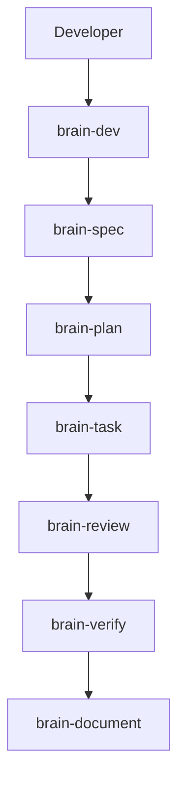

# ForgeFlow Mini

Brain-driven development plugin for Claude Code -- persistent knowledge that learns from every task, dispatches subagents for speed, and protects quality with hooks and guardrails.

<p align="center">
  
  
  
  
  
</p>

**ForgeFlow v3 uses a rigid kernel.** Requests flow through a deterministic sequence, so the same input follows the same public path every time. The execution core is stable; the control flow is not negotiated by hidden heuristics.

**Memory is consultive, not directive.** ForgeFlow keeps architectural knowledge and prior learnings available to the workflow, but memory only informs decisions. It does not rewrite the pipeline or hide state transitions.

**Public commands stay simple.** `/brain-dev`, `/brain-debug`, `/brain-improve`, `/brain-consult`, `/brain-config`, and `/brain-health` are the main public commands. The model reasons over a compact, explicit command set instead of hidden modes.

---

## What's New in v3.0.0

- **Rigid execution kernel** -- the top-level workflow is deterministic and stage-based.
- **Consultive memory** -- architecture knowledge is available to the pipeline without becoming the pipeline.
- **Primary public commands** -- `/brain-dev`, `/brain-debug`, `/brain-improve`, `/brain-consult`, `/brain-config`, and `/brain-health`.

- **83% reduction in skill sizes** -- 5,422 lines to 904 lines across 9 invocable SKILL.md files. Each skill is a lean orchestrator (~80-120 lines).
- **87% reduction in hooks** -- 752 lines (9 hooks in Node.js) to ~90 lines (2 hooks in bash).
- **Complementary files pattern** -- prompts/, templates/, references/ directories loaded on-demand, not baked into SKILL.md.
- **Session orientation via hook** -- brain-orientation is auto-injected at session start, making brain-dev optional for experienced users.
- **Skills consolidated**: brain-init + brain-setup merged into **brain-config**, brain-consolidate + brain-status merged into **brain-health**, brain-consult + brain-mckinsey + brain-codex-review merged into **brain-consult** (3 modes: quick/research/consensus).
- **7 skills retired, 3 new consolidated skills** -- brain-eval absorbed into brain-plan, brain-codex-review became a prompt file in brain-task.

---

## Quickstart

```bash
# Terminal (not inside a Claude Code session):
claude plugin marketplace add https://github.com/leandrotcawork/forgeflow-mini.git
claude plugin install brain-mini@forgeflow-plugins

# Then inside Claude Code:
/brain-config
/brain-dev "Add dark mode toggle"
```

brain-config scans your project, generates hippocampus (architecture + conventions) and cortex (domain knowledge), optionally installs hooks (tiered: minimal/standard), builds the SQLite index, and initializes state files.

<details>
<summary>Troubleshooting: skills don't show up</summary>

- Use **forward slashes** in settings.json paths (even on Windows)
- Verify files exist: `ls ~/.claude/plugins/forgeflow-mini/skills/`
- Restart Claude Code completely (not just reload)
- Check that `auto_load: true` is set

</details>

---

## Which Skill?

| I want to... | Use | What happens |
|---|---|---|
| **Start anything** | `/brain-dev [anything]` | Classifies the request and enters the deterministic v3 kernel. |
| Debug something stuck | `/brain-debug "description"` | Routes the request through the fixed diagnostic path. |
| Improve existing work | `/brain-improve "description"` | Reconciles a change against current conventions and quality goals. |
| Ask a question | `/brain-consult "how should I..."` | Reads consultive memory without changing the workflow. |
| Configure Brain settings | `/brain-config [section]` | Interactive wizard -- browse, edit, validate, and diff brain.config.json sections. |
| Check brain health | `/brain-health` | Staleness, coverage gaps, circuit breaker, and review status. |

---

## Usage Examples

### Example 1: Starting a New Project

```
> /brain-config

[Brain] Scanning project...
  Language: TypeScript (Next.js)
  Structure: monorepo (apps/web, apps/api, packages/shared)
  Tests: Jest + Playwright
  Linting: ESLint + Prettier

[Brain] Generating hippocampus...
  architecture.md -- project structure, tech stack, data flow
  conventions.md  -- naming rules, import order, error handling patterns
  strategy.md     -- product goals, current phase

[Brain] Generating cortex...
  cortex/backend/  -- 4 sinapses (auth, API routes, middleware, DB access)
  cortex/frontend/ -- 3 sinapses (components, state management, routing)
  cortex/database/ -- 2 sinapses (schema patterns, migration conventions)

[Brain] Building brain.db (SQLite + FTS5 indexes)...
  9 sinapses indexed, 0 links
  FTS5 virtual tables: sinapses_fts

[Brain] Install hooks? (minimal/standard/skip): standard
  Installed 2 hooks (session-start + hippocampus-guard)

Ready. Use /brain-dev to start building.
```

### Example 2: Building a Feature

```
> /brain-dev "Add Mercado Livre product listing API integration"

[Brain] Decision: score 45 (backend, medium risk, feature)
  Dispatch: subagent + code-reviewer
  Plan mode: no (score < 50)

[Brain] Loading context...
  Tier 1: architecture + conventions
  Tier 2: 5 backend sinapses (auth, API routes, adapters, error handling, outbox)
  Tokens: ~18k context loaded

[Brain] Implementing via subagent...
  Created: apps/api/src/modules/mercadolivre/adapter.ts
  Created: apps/api/src/modules/mercadolivre/types.ts
  Modified: apps/api/src/modules/mercadolivre/routes.ts

[Brain] Verification (6-phase)...
  Build: pass | Types: pass | Lint: pass | Tests: pass | Security: pass | Diff: clean

[Brain] Task complete: 2026-03-27-ml-product-listing
  Files: 3 created, 1 modified
  Tokens: ~42k total
```

### Example 3: Asking Questions During Implementation (brain-consult)

While implementing a feature, you hit a problem. Instead of raw conversation (no brain context) or jumping into the full pipeline, use `/brain-consult`:

```
> /brain-consult "Why is the Mercado Livre API returning 401 on product listing?"

[Brain] Consult (research) | Domain: backend | Loading context...

The 401 error is likely caused by token expiration. Per your conventions
([[hippocampus-conventions]]), all external API adapters must implement
token refresh logic.

Per [[sinapse-backend-auth]]: your project uses the adapter pattern for
external APIs. The ML SDK uses OAuth2 with 6-hour token expiry.

From documentation (Context7: mercadolibre-sdk):
- Access tokens expire after 6 hours
- Use POST /oauth/token with grant_type=refresh_token
- Store refresh tokens securely (env var, not DB)

Note: embedded `## Lessons Learned` in [[sinapse-backend-auth]] warn that hardcoding
token expiry leads to race conditions -- use the SDK's built-in refresh interceptor instead.

---
Brain context: Tier 1+2 (3 sinapses) + 1 external lookup
```

**Follow-up question (same thread, automatic context reuse):**

```
> /brain-consult "What about rate limiting for the ML API?"

[Brain] Consult (research) | Domain: backend | Thread: continuing...

[Uses prior thread context -- no need to re-explain what ML API is]

The ML API enforces per-app rate limits. From documentation:
- 10,000 requests/hour for certified apps
- Implement exponential backoff with jitter
- Use the X-RateLimit-Remaining header to preemptively throttle

Per [[sinapse-backend-adapters]]: your adapter base class already has
a retryWithBackoff() utility. Use it in the ML adapter.

---
Brain context: Tier 1A (thread reuse) + 1 external lookup
```

**Getting a second opinion:**

```
> /brain-consult --consensus "Should we use the official ML SDK or build a raw HTTP client?"

[Brain] Consult (consensus) | Domain: backend | Models: Claude + Codex

### Claude Assessment (with brain context)
Use the official SDK. Per [[sinapse-backend-adapters]], your project
standardizes on official SDKs when available. The ML SDK handles
OAuth2 refresh, rate limiting, and pagination automatically.

### Codex Assessment
Recommends the official SDK as well, but flags that the SDK's TypeScript
types are incomplete for the /items endpoint. Suggests using the SDK
with a thin type-extension layer for missing fields.

### Synthesis
- Agreement: use the official SDK (maintenance, auth handling, community support)
- Divergence: Codex flags incomplete types that Claude didn't catch
- Recommendation: use SDK + extend types for /items endpoint

---
Brain context: Tier 1+2 (3 sinapses) | Consensus: aligned with nuance
```

### Example 4: Debugging

```
> /brain-dev "debug: Product listing returns empty array but ML API shows products"

[Brain] Decision: score 30 + debugging override
  Dispatch: inline (full codebase access for root cause analysis)

[Brain] Loading debug context...
  Tier 1+2: architecture, conventions, 5 backend sinapses
  Error context: empty array return, expected products

[Brain] Root cause analysis...
  Found: MLAdapter.listProducts() maps response.results but ML API
  returns response.body.results (nested one level deeper)

  Fix: apps/api/src/modules/mercadolivre/adapter.ts:47
  - return response.results.map(mapProduct)
  + return response.body.results.map(mapProduct)

[Brain] Verification: all 6 phases pass
[Brain] Episode captured: episode-2026-03-27-ml-api.md (trigger: struggled)
```

### Example 5: Strategic Architecture Decision

```
> /brain-consult --consensus "Should we cache ML product data locally or always fetch live?"

[Brain] Consult (consensus) -- Strategic Analysis

Internal Scoring:
  Business Impact: 8/10 (reduces API costs, improves response times)
  Tech Risk: 4/10 (cache invalidation is manageable)
  Effort: 6/10 (Redis setup + TTL logic)
  Strategic Alignment: 9/10 (aligns with performance targets)
  Composite: 7.2/10

External Research (parallel):
  - ML API rate limits: 10k/hour, caching reduces pressure
  - Industry practice: TTL cache (15-30 min) is standard for marketplace data
  - ML webhook support: available for price/stock changes (push invalidation)

3 Alternatives:
  A. Redis TTL cache (15 min) + webhook invalidation [Recommended, score 8.1]
  B. In-memory cache (5 min) -- simpler but no persistence [score 6.4]
  C. Full sync with local DB -- maximum speed but complex [score 5.8]

Recommendation: Option A. Redis TTL cache with ML webhooks for
real-time price/stock invalidation. 15-min TTL for catalog data.
```

### Example 6: Checking Brain Health

```
> /brain-health

Brain Health -- my-ecommerce-app

Region           | Sinapses | Avg Weight | Last Updated | Status
-----------------+----------+------------+--------------+-----------
hippocampus      | 5        | 0.87       | 2026-03-27   | healthy
cortex/backend   | 6        | 0.78       | 2026-03-27   | healthy
cortex/frontend  | 3        | 0.71       | 2026-03-25   | healthy
cortex/database  | 2        | 0.62       | 2026-03-22   | stale (5d)
cortex/infra     | 1        | 0.45       | 2026-02-10   | very stale (45d)

Circuit Breaker: closed (normal)

Consultation Activity:
  Total: 23 (Quick: 15, Research: 7, Consensus: 1)
  Active threads: 1 (backend, last: 3 min ago)

Pending: 1 escalation proposal, 2 stale regions need attention
```

### Example 7: Consolidation Cycle

After completing several tasks, review and promote knowledge:

```
> /brain-health --consolidate

[Brain] Consolidation Cycle #3

Inventory: 6 tasks completed since last consolidation
  - 2026-03-27-ml-product-listing (success)
  - 2026-03-27-ml-auth-refresh (success)
  - 2026-03-27-ml-debug-empty-array (success)
  - 2026-03-27-ml-pagination-guard (success)
  - 2026-03-27-ml-rate-limiter (success)
  - 2026-03-27-ml-cache-setup (success)

Sinapse Updates Proposed: 3
  [1] cortex/backend/adapters.md -- add ML adapter patterns [y/n/m]: y
  [2] cortex/backend/auth.md -- add OAuth2 refresh pattern [y/n/m]: y
  [3] sinapses/caching.md -- new cross-cutting cache pattern [y/n/m]: y

Escalation Proposal:
  3 Lessons Learned entries share pattern across sinapses: "ML API response format gotchas"
  Promote to convention? [y/n]: y
  -> Added to hippocampus/conventions.md

Consolidation complete:
  3 sinapse updates approved
  1 convention promoted (confidence 1.0)
  6 task artifacts archived
  Brain.db: 3 sinapses reweighted (+0.02 freshness boost)
```

### Example 8: Quick Pipeline Interrupt (brain-consult)

Mid-task, you need to ask something unrelated. Use `/brain-consult` -- it automatically detects active pipelines and appends a resume reminder:

```
[Brain-task running Step 3 for task 2026-03-27-ml-cache...]

> /brain-consult "What's our Redis connection string format?"

[Brain] Consult (quick) | Domain: infra | Loading context...

It's in .env as REDIS_URL=redis://host:port/db

---
Warning: Brain pipeline active: Task 2026-03-27-ml-cache paused at Step 3.
Resume when ready: /brain-dev
```

### Example 9: Configuring Brain Settings

```
> /brain-config hooks

[Brain Config] Section: hooks

Current values:
| Setting            | Value    | Description                    |
|--------------------|----------|--------------------------------|
| profile            | standard | Hook tier (minimal/standard)   |
| individual_overrides | {}     | Per-hook enable/disable        |

Change a setting? (enter key name or 'done'): profile
New value: minimal
  Before: standard
  After:  minimal
  This disables both hooks (session-start + hippocampus-guard).
  Apply? [y/n]: y

Updated. Change logged to activity.md.
```

### When to Use What -- Decision Flowchart

```
You want to...
    |
    +-- Ask a question? ---------> /brain-consult "question"
    |   |                            Quick: "remind me how we..."
    |   |                            Research: "why is this error..."
    |   |                            --consensus: "which approach..."
    |   |
    |   +-- Mid-pipeline? -------> /brain-consult
    |
    +-- Build/fix/implement? ----> /brain-dev "description"
    |   |                            Auto-routes by complexity score
    |   |
    |   +-- Need a plan first? --> /brain-dev "plan: description"
    |   +-- Debugging? ---------> /brain-dev "debug: description"
    |
    +-- Strategic decision? -----> /brain-consult --consensus "decision"
    |                               Cross-model research + scoring framework
    |
    +-- Review brain state? -----> /brain-health (health dashboard)
    |                               /brain-health --consolidate (batch review + promote)
    |
    +-- Configure? --------------> /brain-config [section]
```

---

## How It Works

### The Pipeline

Every task flows through a self-contained pipeline. Hooks enhance when present but are not required.



> **v3 Pipeline:** brain-dev classifies the request, brain-spec defines scope and acceptance criteria, brain-plan produces the execution plan, brain-task implements the work, brain-review checks the result, brain-verify validates it, and brain-document records approved knowledge. Strictly linear, no loops.

### Subagent Dispatch

brain-task dispatches work based on complexity score:

| Score | Execution | Why |
|---|---|---|
| < 20 | Inline | Too small for subagent overhead |
| 20-39 | Single subagent | Standard feature, isolated execution |
| 40-74 | Subagent + code-reviewer | Complex tasks benefit from review |
| >= 75 | Subagent + spec-reviewer + code-reviewer | Dual review for architectural work |

Subagents get full context inlined in their prompt (not file references). Every subagent path has an inline fallback.

### Intelligent Routing

brain-dev scores every task on a 0-100 complexity scale:

- **Domain**: cross-domain +30, backend +10
- **Risk**: critical +35, high +20, medium +5
- **Type**: architectural +20, debugging +15, unknown_pattern +10
- **Base**: 15

### Three-Tier Context Loading

| Tier | Tokens | Content | When |
|---|---|---|---|
| Tier 1 | ~4k | Hippocampus (condensed) + task | Always |
| Tier 2 | ~10-15k | Domain sinapses (top 5) + cross-cutting + backlinks | Standard tasks |
| Tier 3 | ~5k | Deep linked sinapses | Only if complexity >= 75 |
| Lightweight | ~4k | Tier 1 only | Trivial tasks |

### Resilience

| Feature | How It Works |
|---|---|
| **Circuit Breaker** | 3 failures in 10 min -> OPEN (5-min cooldown) -> HALF-OPEN (probe) -> CLOSED |
| **State Persistence** | brain-state.json (session) + brain-project-state.json (project), survives compaction |
| **Context Pressure** | Tracks usage: <50% low, 65% moderate, 75% high (skip optional steps), 80% critical |

### Hooks (Optional, 2 Tiers)

Hooks never drive workflow -- they add guardrails and orientation.

| Tier | Profile | Hooks |
|---|---|---|
| 0 | `minimal` | No hooks |
| 1 | `standard` | Session-start (orientation + state injection) + hippocampus-guard (block writes) |

Set via `brain.config.json`. Default: `standard`.

### Learning Loop

```
Task completes -> brain-map updates last_accessed + usage_count
               -> brain-health applies usage-based weight bonus (+0.01 per use)
               -> frequently-used sinapses rise in weight, unused ones decay

Task fails -> brain-task auto-captures episode -> brain-health proposes sinapse update -> developer approves -> knowledge persists in sinapse
                    |
              Same pattern seen again (3+ occurrences)
                    |
              brain-health generates escalation proposal
                    |
              Developer approves -> hippocampus/conventions.md
```

---

## Architecture

### Brain Directory Structure

```
.brain/
+-- hippocampus/           Constitution -- architecture, conventions, strategy
+-- cortex/                Domain knowledge -- sinapses
|   +-- backend/
|   +-- frontend/
|   +-- database/
|   +-- infra/
+-- sinapses/              Cross-cutting knowledge flows
+-- working-memory/        Ephemeral task artifacts + brain-state.json + consult-*.json
+-- progress/              activity.md + consult-log.md + brain-health.md + brain-project-state.json
+-- brain.db               SQLite index (sinapses + links + state + FTS5)
```

### Skill Map (10 Skills: 9 invocable + 1 auto-injected)

| Skill | Type | Purpose |
|---|---|---|
| `brain-orientation` | Context (auto-injected) | Session GPS -- injected by session-start hook, not user-invocable |
| `brain-dev` | Router | Primary entry point -- classifies ANY request, scores complexity, routes to the right skill |
| `brain-map` | Context | Loads 3-tier weighted sinapses from brain.db |
| `brain-plan` | Planner | Cortex-Linked TDD planner -- micro-steps, interactive Q&A, developer approval |
| `brain-task` | Implementer | Dispatches subagents or implements inline based on complexity score |
| `brain-debug` | Debugger | Deterministic diagnosis path for stuck or failing work |
| `brain-improve` | Improver | Review and reconcile changes against current conventions |
| `brain-consult` | Consultant | Brain-informed Q&A -- 3 modes (Quick/Research/Consensus) |
| `brain-config` | Configurator | Initialize brain for new projects or edit brain.config.json |
| `brain-health` | Dashboard | Health metrics, consolidation, weight management |

### Hook Architecture (2 Hooks)

Both hooks are bash scripts -- no Node.js dependency.

| Hook | Event | Purpose |
|---|---|---|
| brain-session-start | SessionStart | Inject brain-orientation + project state into session |
| hippocampus-guard | PreToolUse: Write/Edit | Block writes to `.brain/hippocampus/` |

---

## Configuration

### brain.config.json

Located in `.brain/` root after initialization. Key sections:

| Section | Purpose |
|---|---|
| `hooks.profile` | Hook tier: minimal / standard |
| `resilience.circuit_breaker` | Failure threshold, cooldown, window |
| `subagents` | Enable/disable, dispatch threshold |
| `learning` | Confidence initial/promotion thresholds, scope |
| `token_budgets` | Per-skill token allocations |
| `token_optimization` | Compact suggestion threshold, context pressure levels |
| `context_loading` | Tier token limits, always-loaded items |
| `weight_decay` | Rate, min weight, max stale days |

### Token Budgets

| Task Type | Main Context | Subagent Context | Total |
|---|---|---|---|
| Trivial fix (inline) | ~25k | 0 | ~25k |
| Standard feature (subagent) | ~21k | ~49k | ~70k |
| Complex feature (subagent + review) | ~25k | ~110k | ~135k |
| Debugging (inline) | ~130k | 0 | ~130k |
| Consolidation cycle | ~20k | 0 | ~20k |
| Consultation (Quick) | ~3-6k | 0 | ~3-6k |
| Consultation (Research) | ~12-20k | 0 | ~12-20k |
| Consultation (Consensus) | ~15-25k | ~5k | ~20-30k |

---

## Trust and Safety

- **Namespace isolation** -- Brain artifacts live in `.brain/`. Plugin skills live in `~/.claude/plugins/forgeflow-mini/`.
- **No auto-writes to constitution** -- Hippocampus is immutable without developer approval via brain-health.
- **Hippocampus guard hook** -- Blocks writes to `.brain/hippocampus/` at the tool level.
- **Circuit breaker** -- Prevents cascading failures after 3 consecutive errors.
- **Ephemeral by default** -- Task artifacts auto-archived. No stale context accumulates.
- **No telemetry** -- Fully local. brain.db is a SQLite file in your project.
- **Graceful degradation** -- Works without hooks (inline pipeline), without Python (file-based context). Hooks are bash scripts with no external dependencies.

---

## Documentation

| Document | Purpose |
|---|---|
| [brain-db-schema.sql](docs/brain-db-schema.sql) | Canonical SQLite schema (source of truth) |
| [brain-db-schema.md](docs/brain-db-schema.md) | Human explanation of tables, columns, relationships |
| [CHANGELOG.md](CHANGELOG.md) | Version history with all changes |
| Each `skills/*/SKILL.md` | Detailed skill documentation with workflow, examples, anti-patterns |

---

## FAQ

**Do I need to configure hooks?**
No. The pipeline is fully self-contained. Hooks are optional enhancements installed during brain-config. You can skip them entirely (use `minimal` profile).

**Do I need Codex MCP?**
No. Claude handles everything without it. Codex MCP is optional -- when configured, brain-consult can use it for consensus mode.

**Will this break my existing Claude Code setup?**
No. Skills activate only via `/brain-*` commands. Hooks are safely merged into existing settings.json via matcher-based idempotent installation.

**How does subagent dispatch work?**
brain-task scores complexity and dispatches accordingly. Tasks scoring 20+ run as isolated subagents with full context inlined. The subagent runs in a separate context window, returns a report. If it fails, brain-task falls back to inline execution.

**What if brain.db gets corrupted?**
Run `python scripts/build_brain_db.py --brain-path .brain` to rebuild. The markdown files are the source of truth.

**How do I upgrade from v1.x?**
Run `/brain-config --upgrade`. It adds missing config keys, state files, and database tables without touching existing brain content.

**When should I use `/brain-consult` vs `/brain-dev`?**
Use `/brain-consult` for questions ("how should I...", "why is this error...", "which approach..."). Use `/brain-dev` for implementation ("add this feature", "fix this bug", "refactor this module"). Rule of thumb: if the answer requires writing code files, start with `/brain-dev`. If the answer is knowledge or guidance, it is brain-consult.

**What are the three brain-consult modes?**
- **Quick** (3-6k tokens): simple questions with brain context. Auto-selected for "remind me", "which file", "explain".
- **Research** (12-20k tokens): adds external doc lookup via Context7/WebSearch. Auto-selected for "error", "API", "documentation". Also the default when uncertain.
- **Consensus** (15-25k tokens): adds independent Codex analysis. Never auto-selected -- use `--consensus` flag explicitly.

**How much does it cost in tokens?**
A typical 3-task session uses ~210k tokens. Quick consultations cost only 3-6k tokens -- significantly cheaper than a brain-task invocation.

---

## Contributing

1. [Report issues](https://github.com/leandrotcawork/forgeflow-mini/issues)
2. Submit PRs following existing skill structure
3. `git clone https://github.com/leandrotcawork/forgeflow-mini.git`

---

## License

MIT -- see [LICENSE](LICENSE)
