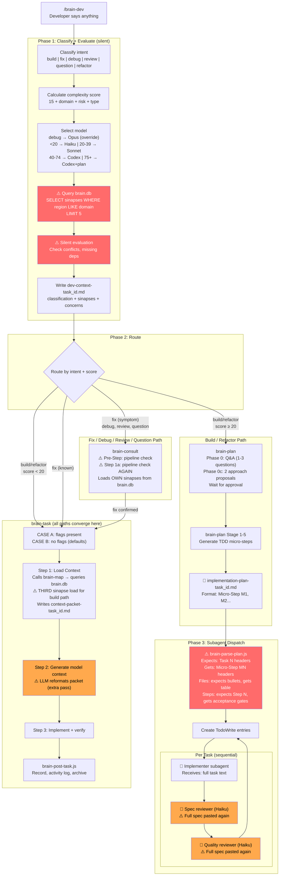
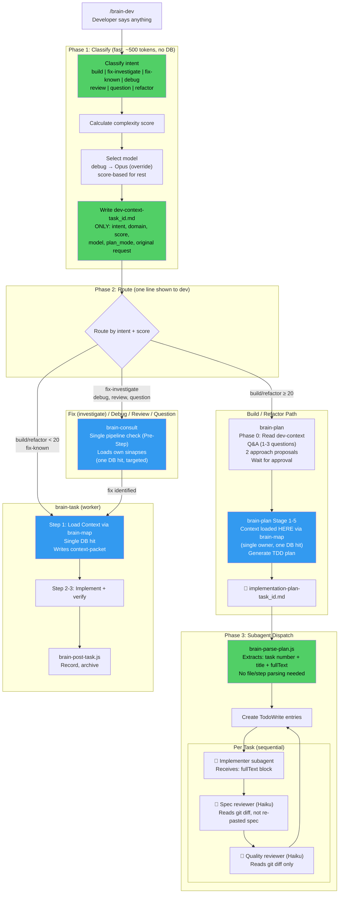
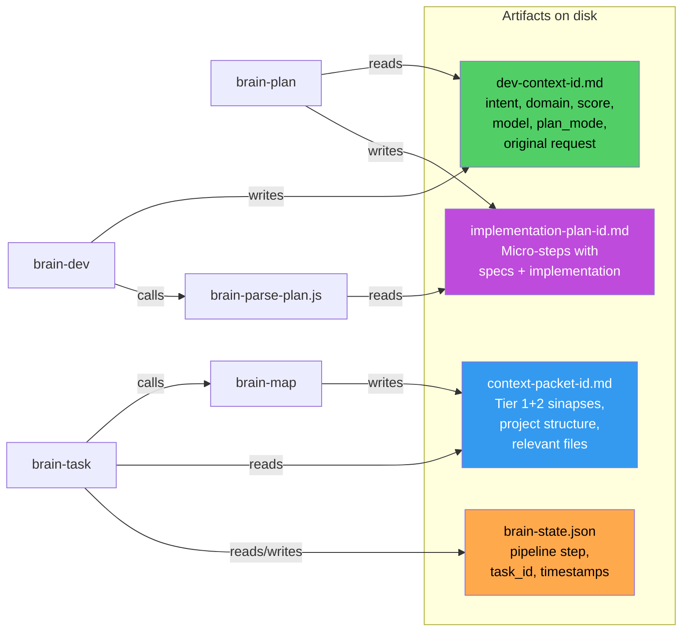

# brain-dev Flow Architecture (v0.9.0 — current vs proposed)

## Current Flow (with issues highlighted)

### Issues visible in the diagram:

| Color | Meaning | Where |
|-------|---------|-------|
| 🔴 Red | Broken or redundant | brain-dev sinapse loading (redundant), brain-parse-plan.js (can't parse actual format) |
| 🟠 Orange | Token waste | Spec pasted twice per task, LLM reformat pass, duplicate pipeline check |

---

## Proposed Flow (clean architecture)

### What changed (proposed):

| Problem | Current | Proposed |
|---------|---------|----------|
| brain-dev queries brain.db | Yes (Phase 1e, 5 sinapses) | No — pure classifier, 0 DB hits |
| Context loading | 2-3 times (brain-dev + brain-map + brain-plan) | Once (brain-map via brain-task only) |
| brain-parse-plan.js | Parses files + steps (broken) | Extracts title + fullText only (robust) |
| Reviewer subagents | Full spec pasted per reviewer | Read git diff instead |
| "fix" routing | Ambiguous single intent | Split: fix-investigate vs fix-known |
| Pipeline check | 3x in brain-consult | 1x in Pre-Step only |
| brain-decision | Parallel router (contradicts brain-dev) | Retired — stub only |
| brain-task Step 2 | LLM reformats context packet | Removed — use packet directly |

---

## Data Flow: What gets written and read

