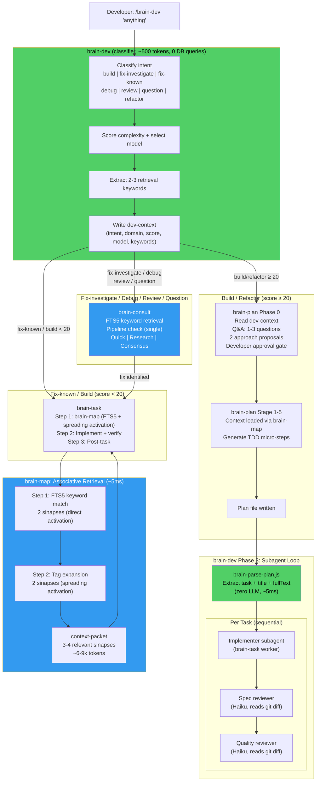

# brain-dev v0.9.1 Architecture Cleanup Implementation Plan

> **For agentic workers:** REQUIRED SUB-SKILL: Use superpowers:subagent-driven-development (recommended) or superpowers:executing-plans to implement this plan task-by-task. Steps use checkbox (`- [ ]`) syntax for tracking.

**Goal:** Fix all architectural ambiguities, contract mismatches, and token waste from v0.9.0. Introduce brain-inspired associative retrieval (FTS5 + spreading activation) to brain-map. Remove brain-decision and brain-aside entirely. Result: a clean, fast, token-efficient plugin with 15 skills and one entry point.

**Architecture:** brain-dev becomes a pure fast classifier (~500-800 tokens, zero DB queries) that extracts retrieval keywords. brain-map gets FTS5 + spreading activation (two-step SQL, ~5ms). brain-task loses its LLM reformatting pass (Step 2 removed). brain-decision and brain-aside are fully deleted.

**Tech Stack:** Node.js (zero deps) for brain-parse-plan.js, SQLite FTS5 for associative retrieval, Markdown SKILL.md files for all skill specs, node:test for unit tests.

---

## File Structure

| # | Action | Path | Purpose |
|---|--------|------|---------|
| F1 | Modify | `skills/brain-dev/SKILL.md` | Pure classifier: remove sinapse loading, add keyword extraction, split fix intent |
| F2 | Delete | `skills/brain-decision/SKILL.md` | Fully absorbed into brain-dev |
| F3 | Modify | `skills/brain-map/SKILL.md` | FTS5 + spreading activation, remove brain-decision refs |
| F4 | Modify | `skills/brain-task/SKILL.md` | Remove Step 2, simplify CASE handling, renumber steps |
| F5 | Rewrite | `scripts/brain-parse-plan.js` | Simplified: extract task + title + fullText only |
| F6 | Rewrite | `tests/brain-parse-plan.test.js` | 5 tests for new fullText format |
| F7 | Modify | `skills/brain-plan/SKILL.md` | Slim dev-context contract, remove brain-decision refs |
| F8 | Modify | `skills/brain-consult/SKILL.md` | Update relationship table, remove brain-decision refs |
| F9 | Delete | `skills/brain-aside/SKILL.md` | Fully deleted (absorbed in v0.9.0) |
| F10 | Delete | `scripts/codex-invoke.js` | Stub script, maintenance liability |
| F11 | Modify | `skills/brain-consolidate/SKILL.md` | Update pipeline diagram |
| F12 | Modify | `skills/brain-codex-review/SKILL.md` | Update pipeline diagram |
| F13 | Modify | `skills/brain-document/SKILL.md` | Update pipeline diagram |
| F14 | Modify | `skills/brain-eval/SKILL.md` | Update brain-decision reference |
| F15 | Modify | `GETTING_STARTED.md` | Update brain-decision reference |
| F16 | Modify | `README.md` | Mermaid diagram, skill count 15, remove brain-decision/aside rows |
| F17 | Modify | `CHANGELOG.md` | v0.9.1 entry |

---

## Task 1: brain-dev — Pure Fast Classifier

**Files:**
- Modify: `skills/brain-dev/SKILL.md`

**Why first:** All downstream skills depend on the dev-context format brain-dev produces. Fix the contract first so later tasks can reference it.

- [ ] **Step 1: Update the frontmatter description**

Find:
```
description: Primary entry point for ALL developer requests — build, fix, debug, review, question, refactor. Classifies intent silently, evaluates against brain knowledge, routes to brain-plan (build/refactor), brain-consult (fix/debug/review/question), or brain-task directly (trivial builds score < 20). Replaces /brain-decision as the developer-facing command.
```

Replace with:
```
description: Primary entry point for ALL developer requests — build, fix, debug, review, question, refactor. Pure classifier (~500-800 tokens, zero DB queries). Extracts retrieval keywords, routes to brain-plan (build/refactor), brain-consult (fix-investigate/debug/review/question), or brain-task directly (trivial builds score < 20, fix-known).
```

- [ ] **Step 2: Update the intro paragraph**

Find:
```
**Use this for everything.** Build, fix, investigate, question, refactor — start here. brain-dev classifies your request, evaluates it silently against what the brain knows, and routes to the right skill. You don't need to think about which skill to call.
```

Replace with:
```
**Use this for everything.** Build, fix, investigate, question, refactor — start here. brain-dev classifies your request in ~500-800 tokens (zero DB queries), extracts retrieval keywords, and routes to the right skill. You don't need to think about which skill to call.
```

- [ ] **Step 3: Split fix intent into fix-investigate and fix-known in Step 1b**

Find the intent classification table row for fix:
```
| **fix** | "fix", "broken", "not working", "error", "failing" | brain-consult (investigation) → brain-task if fix confirmed. If cause is already known and fix is clear, treat as build intent instead. |
```

Replace with two rows:
```
| **fix-investigate** | symptom described: "not working", "getting error", "fails silently", "broken" | brain-consult (investigation) → brain-task if fix identified |
| **fix-known** | specific change described: "fix the null check in auth.js", "change X to Y" | brain-task directly (same path as build) |
```

- [ ] **Step 4: Remove Phase 1e (silent brain evaluation)**

Delete the entire section from `### Step 1e: Silent brain evaluation` through the end of the "4. What are the consequences on other domains?" line. This is approximately 17 lines starting with:
```
### Step 1e: Silent brain evaluation

Load sinapses relevant to the classified domain:
```

And ending with:
```
4. What are the consequences on other domains?
```

- [ ] **Step 5: Add new Step 1e — keyword extraction**

In place of the removed Step 1e, insert:
```
### Step 1e: Extract retrieval keywords

Extract 2-3 keywords from the developer's request. Pure text extraction — no DB query needed.

Rules:
- Pick nouns and domain terms, not verbs ("fix the auth token refresh" → `["auth", "token", "refresh"]`)
- Max 3 keywords — more dilutes FTS5 precision
- If the request is vague ("it's broken"), use the domain as the single keyword (e.g., `["backend"]`)

These keywords are passed downstream via dev-context. brain-map uses them for associative retrieval (FTS5 + spreading activation).
```

- [ ] **Step 6: Replace Phase 1f dev-context template with slim format**

Find the entire `### Step 1f: Write dev-context handoff file` section. Replace everything from that header through the closing triple-backtick of the template (the line before the `---` separator and `## Phase 2: Route`) with:

```
### Step 1f: Write dev-context handoff file

Write `.brain/working-memory/dev-context-{task_id}.md`:

---
task_id: {task_id}
intent: {build|fix-investigate|fix-known|debug|review|question|refactor}
domain: {domain}
score: {N}
model: {haiku|sonnet|codex|opus}
plan_mode: {true|false}
keywords: ["{kw1}", "{kw2}", "{kw3}"]
created_at: {ISO8601}
---

{developer's original request, verbatim — do not paraphrase}

No sinapses. No concerns. No brain evaluation. Just classification metadata + keywords. Context loading is owned by brain-map (called from brain-task Step 1).
```

- [ ] **Step 7: Update Phase 2 routing table**

Find:
```
| fix (investigation needed), debug, review, or question | Invoke `/brain-consult` with task description |
```

Replace with:
```
| fix-investigate / debug / review / question | Invoke `/brain-consult` with task description |
| fix-known | Invoke `/brain-task` directly (same as build < 20) |
```

- [ ] **Step 8: Update Phase 3 spec/quality reviewer prompts — git diff instead of re-pasted spec**

Find the spec-compliance reviewer prompt template (the Agent block for spec review). In the prompt text, find:
```
## Task Spec

{paste FULL task text from plan}

## What to check
```

Replace with:
```
## What to check

Run `git diff HEAD~1` to see exactly what changed. Then verify against the task requirements:
```

Find the quality reviewer prompt template. Replace:
```
First run: `git log --oneline -3` to see recent commits.
Read only the files listed as changed in those commits.
```

With:
```
Run `git diff HEAD~1` to see exactly what changed.
Read only the changed files.
```

- [ ] **Step 9: Update footer**

Find:
```
**Created:** 2026-03-27 | **Replaces:** brain-decision (developer-facing), brain-aside (absorbed into brain-consult) | **Version:** v0.9.0
```

Replace with:
```
**Created:** 2026-03-27 | **Updated:** 2026-03-28 | **Replaces:** brain-decision (deleted), brain-aside (deleted) | **Version:** v0.9.1
```

- [ ] **Step 10: Verify**

```bash
node -e "
var fs = require('fs');
var c = fs.readFileSync('skills/brain-dev/SKILL.md', 'utf-8');
var checks = [
  ['No sinapse loading', !c.includes('Silent brain evaluation')],
  ['No SQL query', !c.includes('SELECT id, title, content, weight, tags')],
  ['Keywords step present', c.includes('Extract retrieval keywords')],
  ['fix-investigate intent', c.includes('fix-investigate')],
  ['fix-known intent', c.includes('fix-known')],
  ['Slim dev-context has keywords', c.includes('keywords:')],
  ['No Brain Evaluation in template', !c.includes('## Brain Evaluation')],
  ['No Relevant Sinapses in template', !c.includes('## Relevant Sinapses')],
  ['v0.9.1 in footer', c.includes('v0.9.1')],
];
checks.forEach(function(c) { console.log((c[1] ? 'PASS' : 'FAIL') + ' ' + c[0]); });
if (!checks.every(function(c) { return c[1]; })) process.exit(1);
"
```

- [ ] **Step 11: Commit**

```bash
git add skills/brain-dev/SKILL.md
git commit -m "refactor(brain-dev): pure classifier — remove sinapse loading, add keywords, split fix intent"
```

---

## Task 2: Delete brain-decision + update all cross-references

**Files:**
- Delete: `skills/brain-decision/SKILL.md`
- Modify: `skills/brain-task/SKILL.md` (brain-decision refs only — main cleanup in Task 4)
- Modify: `skills/brain-map/SKILL.md` (brain-decision refs only — main changes in Task 3)
- Modify: `skills/brain-plan/SKILL.md` (brain-decision refs only — main changes in Task 6)
- Modify: `skills/brain-consult/SKILL.md` (brain-decision refs only — main changes in Task 7)
- Modify: `skills/brain-consolidate/SKILL.md`
- Modify: `skills/brain-codex-review/SKILL.md`
- Modify: `skills/brain-document/SKILL.md`
- Modify: `skills/brain-eval/SKILL.md`
- Modify: `GETTING_STARTED.md`

**Why now:** brain-decision is deleted and every cross-reference must be cleaned. Do this as a dedicated task so nothing is missed.

- [ ] **Step 1: Delete brain-decision**

```bash
rm -rf skills/brain-decision
```

- [ ] **Step 2: Update brain-task cross-references (brain-decision only)**

In `skills/brain-task/SKILL.md`, make these replacements:

Find: `GATE 0: brain-decision MUST run first`
Replace with: `GATE 0: brain-dev MUST run first`

Find: `## Step 0: Route through brain-decision (MANDATORY)`
Replace with: `## Step 0: Route through brain-dev (MANDATORY)`

Find: `**CASE A: Called via brain-decision (flags present)**`
Replace with: `**CASE A: Called via brain-dev (dev-context file present)**`

Find: `brain-decision passes: task_id, complexity_score, model, domain, plan_mode`
Replace with: `brain-dev passes via dev-context file: task_id, score, model, domain, plan_mode, keywords`

Find: `Do NOT invoke brain-decision or brain-dev`
Replace with: `Do NOT invoke brain-dev`

Find: `"snapshot_reason": "brain-decision complete"`
Replace with: `"snapshot_reason": "brain-dev routing complete"`

Find: `## Execution Modes (determined by brain-decision)`
Replace with: `## Execution Modes (determined by brain-dev)`

Find: `brain-decision and brain-dev do NOT call brain-map`
Replace with: `brain-dev does NOT call brain-map`

Find: `The implementation strategy depends on the model tier assigned by brain-decision.`
Replace with: `The implementation strategy depends on the model tier assigned by brain-dev.`

Find: `brain-decision first -> route -> Pre-checks`
Replace with: `brain-dev first -> route -> Pre-checks`

- [ ] **Step 3: Update brain-map cross-references (brain-decision only)**

In `skills/brain-map/SKILL.md`:

Find: `brain-decision → brain-map → brain-task`
Replace with: `brain-dev → brain-map → brain-task`

Find: `Input from brain-decision:`
Replace with: `Input from brain-dev (via dev-context file):`

Find all instances of `[passed directly from brain-decision]` and replace with `[from dev-context file or task description]`

Find: `complexity_score: [0-100 from brain-decision]`
Replace with: `complexity_score: [0-100 from brain-dev]`

Find: `When task keywords are available (from brain-decision)`
Replace with: `When task keywords are available (from brain-dev via dev-context)`

Find: `FTS5 hybrid: when brain-decision provides`
Replace with: `FTS5 hybrid: when brain-dev provides`

- [ ] **Step 4: Update brain-plan cross-references (brain-decision only)**

In `skills/brain-plan/SKILL.md`:

Find: `brain-plan is invoked by brain-dev when plan_mode is true`
(If this text exists from earlier fix, verify it. If the old text `brain-plan is invoked during brain-decision Step 4 when plan mode is triggered` still exists, replace it.)

Find: `brain-decision → brain-map → brain-plan → brain-task`
Replace with: `brain-dev → brain-plan → brain-task (brain-map called within brain-task Step 1)`

- [ ] **Step 5: Update brain-consult anti-pattern row**

In `skills/brain-consult/SKILL.md`:

Find: `| Invoking brain-decision | Skipping the router is the whole point | Direct execution |`
Replace with: `| Invoking brain-dev for simple questions | Overkill for consultation | Direct execution — brain-consult is self-contained |`

- [ ] **Step 6: Update pipeline diagrams in other skills**

In `skills/brain-consolidate/SKILL.md`, `skills/brain-codex-review/SKILL.md`, and `skills/brain-document/SKILL.md`:

Find all instances of `brain-decision` in pipeline diagrams and replace with `brain-dev`.

In `skills/brain-eval/SKILL.md`:

Find the brain-decision reference and replace with `brain-dev`.

- [ ] **Step 7: Update GETTING_STARTED.md**

In `GETTING_STARTED.md`, find any `/brain-decision` reference and replace with `/brain-dev`.

- [ ] **Step 8: Verify no brain-decision references remain in skill files**

```bash
grep -rl "brain-decision" skills/ GETTING_STARTED.md 2>/dev/null && echo "FAIL: references remain" || echo "PASS: no brain-decision references"
```

Note: brain-decision may still appear in CHANGELOG.md, docs/plans/, and docs/specs/ — those are historical records and should NOT be changed.

- [ ] **Step 9: Commit**

```bash
git add -A
git commit -m "refactor: delete brain-decision, update all cross-references to brain-dev"
```

---

## Task 3: brain-map — FTS5 + Spreading Activation

**Files:**
- Modify: `skills/brain-map/SKILL.md`

**Why now:** With brain-dev producing keywords and brain-decision gone, brain-map can be updated to use the new retrieval logic.

- [ ] **Step 1: Replace Tier 2 domain sinapse query with FTS5 + spreading activation**

In `skills/brain-map/SKILL.md`, find the Step 3 Tier 2 section. The current query block starts with:

```sql
-- Query 1: Domain sinapses (top 5 by weight)
SELECT id, title, region, tags, links, weight
FROM sinapses
WHERE region LIKE '%{domain}%'
ORDER BY weight DESC
LIMIT 5
```

Replace the entire Tier 2 query section (all three queries: domain sinapses, cross-cutting sinapses, and backlinks) with:

```sql
-- Step 1: Direct activation (FTS5 keyword match, ~2ms)
-- Keywords come from dev-context file (brain-dev) or task description (direct invocation)
SELECT id, title, content, tags, weight,
       rank AS fts_rank
FROM sinapses_fts
JOIN sinapses s ON s.rowid = sinapses_fts.rowid
WHERE sinapses_fts MATCH '{keywords}'
ORDER BY (s.weight * 0.6) + (rank * -0.4) DESC
LIMIT 2

-- Step 2: Spreading activation (tag expansion, ~3ms)
-- Collect tags from Step 1 results, query for sinapses sharing those tags
SELECT id, title, content, tags, weight
FROM sinapses
WHERE id NOT IN ({step1_ids})
  AND (tags LIKE '%{tag1}%' OR tags LIKE '%{tag2}%' OR tags LIKE '%{tag3}%')
  AND region LIKE '%{domain}%'
ORDER BY weight DESC
LIMIT 2
```

Add this explanation block after the queries:

```
**Associative retrieval (brain-inspired):**
- Step 1 = direct activation: keywords from the task trigger matching sinapses via FTS5
- Step 2 = spreading activation: tags from Step 1 results surface connected sinapses (like neurons firing along synaptic connections)
- Total: 3-4 sinapses, all relevant to the actual task
- Zero LLM cost — pure SQL (~5ms total)

**Fallback:** If FTS5 returns < 2 results (sparse brain, new project), fall back to weight-based query:

SELECT id, title, content, tags, weight
FROM sinapses
WHERE region LIKE '%{domain}%'
ORDER BY weight DESC
LIMIT 5
```

- [ ] **Step 2: Add keyword source documentation**

Find the section that describes where brain-map gets its input. Add after it:

```
### Keyword Source

- **Via brain-dev path:** Read `keywords` field from `.brain/working-memory/dev-context-{task_id}.md`
- **Direct invocation (no dev-context):** Extract 2-3 keywords from the task description inline (simple text extraction — pick nouns and domain terms)
```

- [ ] **Step 3: Update the Tier system table**

Find the existing tier table and replace with:

```
| Tier | Model | Retrieval | Sinapse Count |
|------|-------|-----------|---------------|
| Tier 1 | Haiku | FTS5 only (no spreading) | 2 |
| Tier 1+2 | Sonnet/Codex | FTS5 + spreading activation | 2 + 2 = 4 |
| Tier 1+2+3 | Architectural | FTS5 + spreading + on-demand deep | 4 + N |
```

- [ ] **Step 4: Update the "Next: brain-task Step 2" section**

Find:
```
## Next: brain-task Step 2

This packet will be used by brain-task to generate the model-specific context file:
```

Replace with:
```
## Next: brain-task Step 2

This context packet is read directly by brain-task for implementation. No reformatting pass — the LLM reads the packet as-is.
```

Remove the bullet list of model-specific context files (sonnet-context, codex-context, opus-debug-context) that follows, if present.

- [ ] **Step 5: Update Integration with brain-task section**

Find:
```
3. brain-task Step 2 reads context-packet-{task_id}.md
4. brain-task generates model-specific context file from it
```

Replace with:
```
3. brain-task reads context-packet-{task_id}.md directly for implementation
```

- [ ] **Step 6: Verify**

```bash
node -e "
var fs = require('fs');
var c = fs.readFileSync('skills/brain-map/SKILL.md', 'utf-8');
var checks = [
  ['FTS5 direct activation present', c.includes('Direct activation')],
  ['Spreading activation present', c.includes('Spreading activation')],
  ['Associative retrieval explanation', c.includes('brain-inspired')],
  ['Fallback documented', c.includes('Fallback')],
  ['Keyword source section', c.includes('Keyword Source')],
  ['No brain-decision references', !c.includes('brain-decision')],
];
checks.forEach(function(c) { console.log((c[1] ? 'PASS' : 'FAIL') + ' ' + c[0]); });
if (!checks.every(function(c) { return c[1]; })) process.exit(1);
"
```

- [ ] **Step 7: Commit**

```bash
git add skills/brain-map/SKILL.md
git commit -m "feat(brain-map): FTS5 + spreading activation — associative retrieval replaces weight-only ranking"
```

---

## Task 4: brain-task Cleanup

**Files:**
- Modify: `skills/brain-task/SKILL.md`
- Delete: `scripts/codex-invoke.js`

**Why now:** With brain-decision deleted (Task 2) and brain-map updated (Task 3), brain-task can be cleaned up.

- [ ] **Step 1: Remove Step 2 entirely (LLM context reformatting)**

Delete the entire `## Step 2: Generate Execution Context — DO THIS BEFORE ANY CODE` section. This is a large section (~183 lines) containing Sonnet/Codex/Opus context file templates, gate checks, and state persistence.

Find the header:
```
## Step 2: Generate Execution Context — DO THIS BEFORE ANY CODE
```

Delete from that header through to (but not including) the next top-level step header (likely `## Step 3:`).

Also find the Step 2.5 McKinsey Gate section if it appears between Step 2 and Step 3 — delete it too.

- [ ] **Step 2: Renumber Step 3 to Step 2**

Find: `## Step 3:` (the implementation step header)
Replace with: `## Step 2: Implement + Verify`

Update any remaining references:
- `Step 3.5` becomes `Step 2.5` (verification gate)
- References to `Steps 4-6` become `Step 3` (post-task via brain-post-task.js)

- [ ] **Step 3: Remove Step 2 artifact from tables**

Find the artifact row for Step 2 in any Files Created or Artifact tables:
```
| 2 | `.brain/working-memory/[model]-context-{task_id}.md`
```
Remove this entire row.

- [ ] **Step 4: Delete codex-invoke.js**

```bash
rm scripts/codex-invoke.js
```

- [ ] **Step 5: Verify**

```bash
node -e "
var fs = require('fs');
var c = fs.readFileSync('skills/brain-task/SKILL.md', 'utf-8');
var checks = [
  ['No Step 2 reformatting', !c.includes('Generate Execution Context')],
  ['No model-specific context files', !c.includes('sonnet-context-{task_id}')],
  ['No brain-decision refs', !c.includes('brain-decision')],
  ['Step 2 is implementation', c.includes('Implement')],
  ['codex-invoke deleted', !fs.existsSync('scripts/codex-invoke.js')],
];
checks.forEach(function(c) { console.log((c[1] ? 'PASS' : 'FAIL') + ' ' + c[0]); });
if (!checks.every(function(c) { return c[1]; })) process.exit(1);
"
```

- [ ] **Step 6: Commit**

```bash
git add -A
git commit -m "refactor(brain-task): remove Step 2 LLM reformat, renumber steps, delete codex-invoke.js"
```

---

## Task 5: brain-parse-plan.js Rewrite + Tests

**Files:**
- Rewrite: `scripts/brain-parse-plan.js`
- Rewrite: `tests/brain-parse-plan.test.js`

- [ ] **Step 1: Write the failing tests first**

Replace the entire content of `tests/brain-parse-plan.test.js` with:

```javascript
'use strict';

var parsePlan = require('../scripts/brain-parse-plan.js').parsePlan;
var assert = require('node:assert/strict');
var test = require('node:test');

test.describe('parsePlan', function () {

  test.it('returns empty array for content with no task headers', function () {
    var result = parsePlan('# Just a header\n\nSome text.');
    assert.deepStrictEqual(result, []);
  });

  test.it('captures fullText for a single task', function () {
    var md = [
      '### Task 1: Fix Something',
      '',
      '**Files:**',
      '- Create: `src/foo.js`',
      '',
      '- [ ] **Step 1: Write the test**',
      '- [ ] **Step 2: Implement**',
      ''
    ].join('\n');
    var result = parsePlan(md);
    assert.strictEqual(result.length, 1);
    assert.strictEqual(result[0].task, 1);
    assert.strictEqual(result[0].title, 'Fix Something');
    assert.ok(result[0].fullText.includes('**Files:**'));
    assert.ok(result[0].fullText.includes('Step 1: Write the test'));
    assert.ok(result[0].fullText.includes('src/foo.js'));
  });

  test.it('splits multiple tasks without bleeding fullText', function () {
    var md = [
      '### Task 1: First',
      '',
      'Content of task 1.',
      '',
      '### Task 2: Second',
      '',
      'Content of task 2.',
      ''
    ].join('\n');
    var result = parsePlan(md);
    assert.strictEqual(result.length, 2);
    assert.strictEqual(result[0].title, 'First');
    assert.ok(result[0].fullText.includes('Content of task 1'));
    assert.ok(!result[0].fullText.includes('Content of task 2'));
    assert.strictEqual(result[1].title, 'Second');
    assert.ok(result[1].fullText.includes('Content of task 2'));
    assert.ok(!result[1].fullText.includes('Content of task 1'));
  });

  test.it('parses Micro-Step MN format', function () {
    var md = [
      '### Micro-Step M3: Write auth handler',
      '',
      '| File | Action |',
      '| src/auth.js | create |',
      '',
      '- [ ] Spec: test auth returns 200',
      ''
    ].join('\n');
    var result = parsePlan(md);
    assert.strictEqual(result.length, 1);
    assert.strictEqual(result[0].task, 3);
    assert.strictEqual(result[0].title, 'Write auth handler');
    assert.ok(result[0].fullText.includes('| src/auth.js | create |'));
  });

  test.it('preserves code blocks tables and blank lines in fullText', function () {
    var md = [
      '### Task 1: Complex content',
      '',
      '```javascript',
      'function foo() { return 42; }',
      '```',
      '',
      '| Col1 | Col2 |',
      '|------|------|',
      '| a    | b    |',
      '',
      'Final paragraph.',
      ''
    ].join('\n');
    var result = parsePlan(md);
    assert.strictEqual(result.length, 1);
    assert.ok(result[0].fullText.includes('function foo() { return 42; }'));
    assert.ok(result[0].fullText.includes('| Col1 | Col2 |'));
    assert.ok(result[0].fullText.includes('Final paragraph.'));
  });

});
```

- [ ] **Step 2: Run tests to verify they fail**

```bash
node --test tests/brain-parse-plan.test.js
```

Expected: tests fail because the current parsePlan returns `{ task, title, files, steps }` not `{ task, title, fullText }`.

- [ ] **Step 3: Rewrite brain-parse-plan.js**

Replace the entire content of `scripts/brain-parse-plan.js` with:

```javascript
#!/usr/bin/env node
/**
 * brain-parse-plan.js — Parse implementation plan MD → JSON task array
 *
 * Usage: node scripts/brain-parse-plan.js <plan-file.md>
 * Output: JSON array of { task, title, fullText } to stdout
 * Exit:  0=success, 2=invalid args, 3=parse/read error
 *
 * Pure Node.js — zero npm dependencies.
 */

'use strict';

var fs = require('fs');
var path = require('path');

/**
 * Parse plan markdown content into a task array.
 * @param {string} content - raw markdown content of the plan file
 * @returns {{ task: number, title: string, fullText: string }[]}
 */
function parsePlan(content) {
  var tasks = [];
  var blocks = content.split(/(?=^### (?:Task \d+|Micro-Step M\d+):)/m);

  for (var i = 0; i < blocks.length; i++) {
    var block = blocks[i];
    var titleMatch = block.match(/^### (?:Task (\d+)|Micro-Step M(\d+)): (.+)$/m);
    if (!titleMatch) continue;

    var taskNum = parseInt(titleMatch[1] || titleMatch[2], 10);
    var title = (titleMatch[3] || '').trim();
    var fullText = block.trim();

    tasks.push({ task: taskNum, title: title, fullText: fullText });
  }

  return tasks;
}

function main() {
  var filePath = process.argv[2];

  if (!filePath) {
    process.stderr.write('Usage: node scripts/brain-parse-plan.js <plan-file.md>\n');
    process.stderr.write('Output: JSON array of tasks to stdout\n');
    process.exit(2);
  }

  var absPath = path.resolve(filePath);

  var content;
  try {
    content = fs.readFileSync(absPath, 'utf-8');
  } catch (err) {
    process.stderr.write('[brain-parse-plan] Error reading file: ' + err.message + '\n');
    process.exit(3);
  }

  try {
    var tasks = parsePlan(content);
    process.stdout.write(JSON.stringify(tasks, null, 2) + '\n');
  } catch (err) {
    process.stderr.write('[brain-parse-plan] Error parsing plan: ' + err.message + '\n');
    process.exit(3);
  }
}

module.exports = { parsePlan: parsePlan };

if (require.main === module) {
  main();
}
```

- [ ] **Step 4: Run tests to verify they pass**

```bash
node --test tests/brain-parse-plan.test.js
```

Expected: 5 tests passing, 0 failed.

- [ ] **Step 5: Verify syntax**

```bash
node -c scripts/brain-parse-plan.js
```

Expected: `scripts/brain-parse-plan.js syntax OK`

- [ ] **Step 6: Commit**

```bash
git add scripts/brain-parse-plan.js && git add -f tests/brain-parse-plan.test.js
git commit -m "refactor(brain-parse-plan): simplify to task + title + fullText extraction (5 tests)"
```

---

## Task 6: brain-plan Contract Fix

**Files:**
- Modify: `skills/brain-plan/SKILL.md`

- [ ] **Step 1: Update Phase 0 Step 0a for slim dev-context**

Find the Step 0a section:
```
### Step 0a: Read dev-context handoff file

Read `.brain/working-memory/dev-context-{task_id}.md` (written by brain-dev Phase 1).

Extract from frontmatter:
- `intent`, `domain`, `complexity_score`, `model`

Read prose sections:
- `## Brain Evaluation` section — contains brain-dev's concerns (conflicts, missing deps, alternative patterns)
- `## Relevant Sinapses` section — sinapses already loaded by brain-dev (do NOT re-query these from brain.db)

If the file does NOT exist (brain-plan called standalone without brain-dev):
→ Load context yourself: query brain.db for domain sinapses (Tier 1, max 5). Continue to Step 0b.
```

Replace with:
```
### Step 0a: Read dev-context handoff file

Read `.brain/working-memory/dev-context-{task_id}.md` (written by brain-dev Phase 1).

Extract from frontmatter:
- `intent`, `domain`, `score`, `model`, `plan_mode`, `keywords`
- Read the original request (body text after frontmatter)

Use `keywords` to inform your Q&A questions in Step 0b.

brain-plan does NOT load sinapses or query brain.db. Context loading happens when brain-task runs (brain-map is called at brain-task Step 1, after the plan is approved and brain-dev dispatches implementer subagents).

If the file does NOT exist (brain-plan called standalone without brain-dev):
→ Ask the developer for intent/domain context directly. Proceed to Step 0b.
```

- [ ] **Step 2: Fix plan mode trigger — remove phantom condition**

Search for any occurrence of `type == critical` or `type = critical` as a plan mode trigger condition. If found, remove it. The valid triggers are: `score >= 50, OR type = architectural, OR risk = critical, OR --plan flag`.

- [ ] **Step 3: Verify**

```bash
node -e "
var fs = require('fs');
var c = fs.readFileSync('skills/brain-plan/SKILL.md', 'utf-8');
var checks = [
  ['Slim dev-context format', c.includes('score') && c.includes('keywords')],
  ['No Brain Evaluation reference', !c.includes('Brain Evaluation section')],
  ['No Relevant Sinapses reference', !c.includes('Relevant Sinapses section')],
  ['brain-plan does not load sinapses', c.includes('brain-plan does NOT load sinapses')],
  ['No brain-decision refs', !c.includes('brain-decision')],
];
checks.forEach(function(c) { console.log((c[1] ? 'PASS' : 'FAIL') + ' ' + c[0]); });
if (!checks.every(function(c) { return c[1]; })) process.exit(1);
"
```

- [ ] **Step 4: Commit**

```bash
git add skills/brain-plan/SKILL.md
git commit -m "fix(brain-plan): slim dev-context contract, remove phantom type==critical condition"
```

---

## Task 7: brain-consult Cleanup

**Files:**
- Modify: `skills/brain-consult/SKILL.md`

- [ ] **Step 1: Update relationship table**

Find the brain-aside row:
```
| **brain-aside** | Absorbed. brain-aside pipeline-check behaviour absorbed into brain-consult Pre-Step as of v0.9.0. brain-aside is deprecated — use brain-consult. |
```

Replace with:
```
| **brain-aside** | Deleted. brain-aside was absorbed into brain-consult Pre-Step in v0.9.0 and fully removed in v0.9.1. Pipeline check lives in brain-consult Pre-Step. |
```

Find and delete the entire brain-decision row:
```
| **brain-decision** | Not invoked. brain-consult skips the router entirely. If consultation reveals need for implementation, suggest /brain-task (which goes through brain-decision). |
```

Find the brain-task row:
```
| **brain-task** | Escalation target. When consultation evolves into implementation, suggest /brain-task. |
```

Replace with:
```
| **brain-task** | Escalation target. When consultation evolves into implementation, suggest /brain-dev for full routing. |
```

- [ ] **Step 2: Verify**

```bash
node -e "
var fs = require('fs');
var c = fs.readFileSync('skills/brain-consult/SKILL.md', 'utf-8');
var checks = [
  ['No brain-decision in file', !c.includes('brain-decision')],
  ['brain-aside marked deleted', c.includes('Deleted. brain-aside')],
  ['brain-task suggests brain-dev', c.includes('suggest /brain-dev')],
  ['Pipeline check in Pre-Step', c.includes('Pre-Step: Pipeline Check')],
];
checks.forEach(function(c) { console.log((c[1] ? 'PASS' : 'FAIL') + ' ' + c[0]); });
if (!checks.every(function(c) { return c[1]; })) process.exit(1);
"
```

- [ ] **Step 3: Commit**

```bash
git add skills/brain-consult/SKILL.md
git commit -m "fix(brain-consult): update relationship table — brain-decision removed, brain-aside deleted"
```

---

## Task 8: Delete brain-aside

**Files:**
- Delete: `skills/brain-aside/SKILL.md`

- [ ] **Step 1: Delete brain-aside**

```bash
rm -rf skills/brain-aside
```

- [ ] **Step 2: Verify deletion**

```bash
ls skills/brain-aside 2>/dev/null && echo "FAIL: directory still exists" || echo "PASS: brain-aside deleted"
```

- [ ] **Step 3: Commit**

```bash
git add -A
git commit -m "refactor: delete brain-aside entirely (absorbed into brain-consult)"
```

---

## Task 9: README + CHANGELOG

**Files:**
- Modify: `README.md`
- Modify: `CHANGELOG.md`

- [ ] **Step 1: Update badges**

Find: `Skills-16-orange`
Replace with: `Skills-15-orange`

Find: `Version-0.9.0-blue`
Replace with: `Version-0.9.1-blue`

- [ ] **Step 2: Update intro paragraph**

Find: `brain-decision classifies complexity (0-100), selects the optimal model`
Replace with: `brain-dev classifies complexity (0-100), selects the optimal model`

- [ ] **Step 3: Remove brain-aside from "Which Skill?" table**

Find and delete the entire brain-aside row (the line containing `/brain-aside`).

- [ ] **Step 4: Remove brain-aside from decision flowchart**

Find: `(deprecated: /brain-aside → use /brain-consult)`
Replace with empty string or remove the parenthetical entirely. The line should just show `/brain-consult`.

- [ ] **Step 5: Replace flow section with Mermaid diagram**

Find the existing pipeline/flow section (the ASCII art showing `brain-decision -> brain-task (Steps 1-6)`). Replace the entire block with this Mermaid diagram:

````markdown

````

- [ ] **Step 6: Update "Intelligent Routing" section**

Find: `brain-decision scores every task`
Replace with: `brain-dev scores every task`

- [ ] **Step 7: Update Skill Map table**

Remove the brain-decision row:
```
| `brain-decision` | Router | Classifies, scores, routes, circuit breaker check |
```

Remove the brain-aside row:
```
| `brain-aside` | Interrupt Handler | Pipeline interrupt — saves state, no context loading **(deprecated — use brain-consult)** |
```

Update the section header:
Find: `### Skill Map (16 Skills)`
Replace with: `### Skill Map (15 Skills)`

Update brain-dev row description:
Find: `Primary entry point — classifies ANY request, evaluates against brain knowledge, routes to brain-plan/brain-consult/brain-task. Replaces brain-decision as the developer-facing command.`
Replace with: `Primary entry point — classifies ANY request (~500 tokens, 0 DB), extracts retrieval keywords, routes to brain-plan/brain-consult/brain-task.`

- [ ] **Step 8: Add v0.9.1 CHANGELOG entry**

In `CHANGELOG.md`, insert before the `## [0.9.0]` line:

```markdown
## [0.9.1] — 2026-03-28

### Added
- **Associative retrieval in brain-map** — FTS5 + spreading activation (tag expansion). Two-step SQL query (~5ms, zero LLM) replaces weight-only ranking. Loads 3-4 relevant sinapses instead of 5 generic heavy ones. Brain-inspired: direct activation (keyword match) then spreading activation (related tags surface connected sinapses).
- **Keyword extraction in brain-dev** — 2-3 retrieval keywords extracted during classification and passed downstream via dev-context file. Enables associative retrieval without extra LLM cost.
- **Mermaid architecture diagram in README** — full visual flow from developer input through classification, routing, planning, and subagent dispatch.

### Removed
- **brain-decision** — fully absorbed into brain-dev. File deleted. All cross-references updated across 10+ skill files.
- **brain-aside** — fully deleted (was deprecated stub since v0.9.0). Pipeline check lives in brain-consult Pre-Step.
- **codex-invoke.js** — stub script deleted. Codex invocation handled inline in brain-task.
- **brain-task Step 2** — LLM context reformatting pass removed. Context packet from brain-map used directly by the LLM.
- **brain-dev Phase 1e** — sinapse loading removed from brain-dev. brain-dev is now a pure classifier (zero DB queries, ~500-800 tokens).

### Changed
- **brain-dev** — pure classifier: classify intent (7 intents including fix-investigate/fix-known split), calculate score, select model, extract keywords, write slim dev-context, route. No brain.db queries.
- **brain-task** — simplified to 3 steps: Load Context (brain-map) → Implement + Verify → Post-task. CASE handling updated for brain-dev.
- **brain-parse-plan.js** — simplified to extract task + title + fullText only. Removed broken files/steps parsing. 5 tests.
- **brain-plan** — Phase 0 reads slim dev-context (keywords + classification only). Removed brain-decision references. Fixed phantom `type == critical` condition.
- **brain-consult** — updated relationship table: brain-decision removed, brain-aside marked deleted, brain-task suggests brain-dev.

### Performance
- **Context loading:** ~6-9k tokens (3-4 relevant sinapses) instead of ~10-15k (5 generic ones)
- **brain-dev classification:** ~500-800 tokens (was ~2-3k with sinapse loading)
- **brain-task:** one fewer LLM pass per task (Step 2 removed)
- **Reviewer subagents:** read git diff instead of re-pasted spec (saves ~2-8k tokens per review)

```

- [ ] **Step 9: Verify**

```bash
node -e "
var fs = require('fs');
var readme = fs.readFileSync('README.md', 'utf-8');
var changelog = fs.readFileSync('CHANGELOG.md', 'utf-8');
var checks = [
  ['Badge says 15', readme.includes('Skills-15')],
  ['Version 0.9.1', readme.includes('Version-0.9.1')],
  ['No brain-decision in skill table', !readme.includes('brain-decision')],
  ['No brain-aside in Which Skill', !/\brain-aside\b/.test(readme.split('Skill Map')[0])],
  ['Mermaid diagram present', readme.includes('flowchart TB')],
  ['brain-dev in intro', readme.includes('brain-dev classifies')],
  ['CHANGELOG v0.9.1', changelog.includes('[0.9.1]')],
  ['CHANGELOG spreading activation', changelog.includes('spreading activation')],
  ['Skill Map says 15', readme.includes('15 Skills')],
];
checks.forEach(function(c) { console.log((c[1] ? 'PASS' : 'FAIL') + ' ' + c[0]); });
if (!checks.every(function(c) { return c[1]; })) process.exit(1);
"
```

- [ ] **Step 10: Commit**

```bash
git add README.md CHANGELOG.md
git commit -m "docs: v0.9.1 — Mermaid diagram, 15 skills, associative retrieval, brain-decision/aside removed"
```

---

## Self-Review

**Spec coverage check:**

| Spec requirement | Covered by task |
|-----------------|----------------|
| brain-dev pure classifier (no DB) | Task 1 |
| brain-dev keyword extraction | Task 1 Step 5 |
| fix-investigate / fix-known split | Task 1 Step 3 |
| Slim dev-context format | Task 1 Step 6 |
| brain-decision full removal | Task 2 |
| All brain-decision cross-refs updated | Task 2 (10+ files) |
| brain-map FTS5 + spreading activation | Task 3 |
| brain-map keyword source docs | Task 3 Step 2 |
| brain-map fallback for sparse brain | Task 3 Step 1 |
| brain-task Step 2 removed | Task 4 Step 1 |
| brain-task renumbered to 3 steps | Task 4 Step 2 |
| codex-invoke.js deleted | Task 4 Step 4 |
| brain-parse-plan.js simplified to fullText | Task 5 |
| 5 new tests for fullText format | Task 5 Step 1 |
| brain-plan slim dev-context contract | Task 6 |
| brain-plan phantom condition fixed | Task 6 Step 2 |
| brain-consult relationship table | Task 7 |
| brain-aside full removal | Task 8 |
| README Mermaid diagram | Task 9 Step 5 |
| README skill count 15 | Task 9 Step 7 |
| CHANGELOG v0.9.1 | Task 9 Step 8 |
| Reviewer subagents read git diff | Task 1 Step 8 |
| Pipeline diagrams in consolidate/codex-review/document/eval | Task 2 Step 6 |
| GETTING_STARTED.md updated | Task 2 Step 7 |

**Placeholder scan:** No TBD, TODO, or incomplete sections. All steps have exact text replacements.

**Type consistency:** `parsePlan` returns `{ task, title, fullText }` in both the script (Task 5 Step 3) and the tests (Task 5 Step 1). dev-context fields (`task_id, intent, domain, score, model, plan_mode, keywords`) are consistent between brain-dev (Task 1 Step 6) and brain-plan (Task 6 Step 1).
