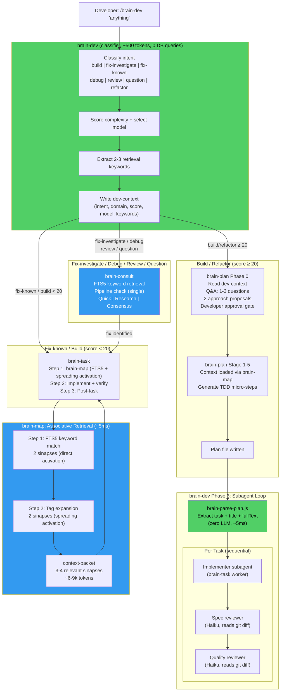

# brain-dev v0.9.1 — Architecture Cleanup & Associative Retrieval

> **Goal:** Fix all architectural ambiguities, contract mismatches, and token waste identified in the v0.9.0 review. Introduce brain-inspired associative retrieval (FTS5 + spreading activation) to brain-map. Remove brain-decision and brain-aside entirely. Result: a clean, fast, token-efficient plugin with 14 skills and one entry point.

---

## Design Decisions (from brainstorming)

| Decision | Choice | Why |
|----------|--------|-----|
| brain-decision fate | Fully absorbed — file deleted | One router, no ambiguity |
| brain-dev DB queries | Zero — pure classifier | Fast (~500-800 tokens), no redundant loading |
| "fix" intent | Split into fix-investigate and fix-known | fix-investigate → brain-consult, fix-known → brain-task |
| Context retrieval | FTS5 + spreading activation (two-step SQL) | Brain-inspired associative retrieval, ~5ms, zero LLM |
| brain-parse-plan.js | Extracts task + title + fullText only | Robust, format-agnostic, implementer reads the details |
| brain-aside fate | Fully deleted | Already absorbed into brain-consult in v0.9.0 |
| brain-task Step 2 | Removed (LLM context reformat) | Pure token waste — context packet used directly |
| codex-invoke.js | Deleted | Stub script documenting inline behavior — maintenance drift |

---

## Section 1: brain-dev — Pure Fast Classifier

brain-dev is the single entry point for all developer requests. It does zero brain.db queries.

### Phase 1: Classify (~500-800 tokens, no DB)

1. **Classify intent** — 7 intents:

| Intent | Signals | Routes to |
|--------|---------|-----------|
| **build** | "implement", "add", "create", "build", "make" | brain-plan (≥20) or brain-task (<20) |
| **fix-investigate** | symptom described: "not working", "getting error", "fails silently" | brain-consult → brain-task if fix identified |
| **fix-known** | specific change described: "fix the null check in auth.js" | brain-task directly (same as build) |
| **debug** | "why is", "investigate", "figure out", "trace" | brain-consult (Opus override) |
| **review** | "is this right", "should we", "review this" | brain-consult (consensus mode) |
| **question** | "how does", "explain", "what is" | brain-consult (quick/research) |
| **refactor** | "refactor", "clean up", "restructure" | brain-plan (≥20) or brain-task (<20) |

2. **Calculate complexity score** — same formula: `15 + domain + risk + type`, capped at 100

3. **Select model:**
   - `debug` intent → Opus (PRIORITY OVERRIDE, always, regardless of score)
   - Score < 20 → Haiku
   - Score 20-39 → Sonnet
   - Score 40-74 → Codex
   - Score 75+ → Codex + plan mode

4. **Extract 2-3 retrieval keywords** from the task description. Pure text extraction — no DB query. Example: "fix the auth token refresh" → `["auth", "token", "refresh"]`

5. **Write slim dev-context file** at `.brain/working-memory/dev-context-{task_id}.md`:

```yaml
---
task_id: {task_id}
intent: {intent}
domain: {domain}
score: {N}
model: {model}
plan_mode: {true|false}
keywords: ["{kw1}", "{kw2}", "{kw3}"]
created_at: {ISO8601}
---

{developer's original request, verbatim}
```

No sinapses. No concerns. No brain evaluation. Just classification metadata + keywords.

### Phase 2: Route

Output one line to developer:
```
🧠 brain-dev: {task_id} | {intent} | {domain} | Score {N} → {Model} | Routing to {target}
```

| Condition | Route |
|-----------|-------|
| build/refactor AND score ≥ 20 | Invoke brain-plan (reads dev-context for keywords) |
| build/refactor AND score < 20 | Invoke brain-task directly (Haiku, no plan) |
| fix-known | Invoke brain-task directly |
| fix-investigate / debug / review / question | Invoke brain-consult |

### Phase 3: Subagent Dispatch

Runs only after brain-plan returns an approved plan.

1. `node scripts/brain-parse-plan.js {plan-file}` → JSON array of `{ task, title, fullText }`
2. Create TodoWrite entry per task
3. For each task sequentially:
   - Dispatch implementer subagent with `fullText` pasted verbatim
   - Handle status: DONE → review, DONE_WITH_CONCERNS → assess then review, NEEDS_CONTEXT → re-dispatch, BLOCKED → escalate
   - Dispatch spec reviewer (Haiku) — reads git diff, not re-pasted spec
   - Dispatch quality reviewer (Haiku) — reads git diff only
   - Mark complete, next task
4. Post-execution: suggest `/brain-lesson` if new pattern surfaced, run `/brain-status`

---

## Section 2: brain-decision — Full Removal

Delete `skills/brain-decision/SKILL.md` and its directory entirely.

**Cross-reference updates required:**
- brain-task: remove all brain-decision mentions from CASE handling
- brain-plan: "invoked during brain-decision Step 4" → "invoked by brain-dev"
- brain-consult: remove brain-decision from relationship table
- README: remove from skill table, "Which Skill?" table, flow diagram
- Skill count: -1

---

## Section 3: brain-map — FTS5 + Spreading Activation

brain-map's query logic changes from weight-only ranking to associative retrieval. Zero LLM cost — pure SQL.

### Where keywords come from

- If `dev-context-{task_id}.md` exists: read `keywords` field
- If no dev-context (direct brain-task invocation): extract keywords from task description inline

### Two-step retrieval

**Step 1 — Direct activation (FTS5, ~2ms):**
```sql
SELECT id, title, content, tags, weight
FROM sinapses_fts
JOIN sinapses s ON s.rowid = sinapses_fts.rowid
WHERE sinapses_fts MATCH '{keywords}'
ORDER BY (s.weight * 0.6) + (rank * -0.4) DESC
LIMIT 2
```

**Step 2 — Spreading activation (tag expansion, ~3ms):**
```sql
-- Collect tags from Step 1 results
SELECT id, title, content, tags, weight
FROM sinapses
WHERE id NOT IN ({step1_ids})
  AND (tags LIKE '%{tag1}%' OR tags LIKE '%{tag2}%')
  AND region LIKE '%{domain}%'
ORDER BY weight DESC
LIMIT 2
```

Total: 3-4 sinapses, all relevant to the actual task. Down from 5 generic heavy ones.

### Fallback

If FTS5 returns < 2 results (sparse brain, new project): fall back to current weight-based query `ORDER BY weight DESC LIMIT 5`. Preserves compatibility.

### Tier system (unchanged structure, new retrieval)

| Tier | Model | Sinapses |
|------|-------|----------|
| Tier 1 | Haiku | 2 via FTS5 only, no spreading |
| Tier 1+2 | Sonnet/Codex | 2 FTS5 + 2 spreading = 4 |
| Tier 1+2+3 | Architectural | 2 FTS5 + 2 spreading + on-demand deep load |

### Token impact

~6-9k context instead of ~10-15k. Every sinapse is relevant to the task.

---

## Section 4: brain-task Cleanup

### Remove Step 2 (LLM context reformatting)

brain-task currently does a full LLM generation pass to reformat the context packet from brain-map. This is removed — the LLM reads the context packet directly.

### Simplified CASE handling

```
CASE A: dev-context file exists (called via brain-dev)
  → Read dev-context for task_id, model, domain, score, keywords
  → Pass keywords to brain-map for associative retrieval

CASE B: No dev-context (called directly by user)
  → Defaults: score=50, model=sonnet, domain=cross-domain
  → Extract keywords from task description inline
  → Log warning: "For optimal results, use /brain-dev"
```

No mention of brain-decision.

### Renumbered steps

- Step 1: Load Context (brain-map with spreading activation)
- Step 2: Implement + Verify (was Step 3)
- Step 3: Post-task via brain-post-task.js (was Steps 4-6)

### Other fixes

- Replace all `--dispatch` with `--subagents` (3 occurrences)
- Delete `scripts/codex-invoke.js` (stub documenting inline behavior)

---

## Section 5: brain-parse-plan.js — Simplified

### New output format

```json
[
  { "task": 1, "title": "Write auth handler", "fullText": "entire markdown block..." },
  { "task": 2, "title": "Add tests", "fullText": "entire markdown block..." }
]
```

### What's removed

- `files` array extraction (broken — brain-plan uses tables, parser expected bullets)
- `steps` array extraction (broken — brain-plan uses acceptance gates, parser expected checkboxes)
- All fragile format-specific regexes

### What remains

- Split on `### Task N:` or `### Micro-Step MN:` headers
- Extract task number (integer) and title (string)
- Capture everything between one header and the next as `fullText` (verbatim)
- CLI interface unchanged: `node scripts/brain-parse-plan.js <plan-file.md>`
- Exit codes unchanged: 0=success, 2=invalid args, 3=read/parse error

### Updated tests (~5 tests)

1. Empty array for no headers
2. Single task with fullText captured
3. Multiple tasks split correctly — fullText doesn't bleed between tasks
4. Micro-Step MN format works
5. fullText preserves everything: code blocks, tables, checkboxes, blank lines

---

## Section 6: brain-plan Contract Fix

### Phase 0 Step 0a — reads slim dev-context

```
Read dev-context-{task_id}.md
Extract: intent, domain, score, model, plan_mode, keywords, original request

Use keywords to inform Q&A questions in Step 0b.
brain-plan does NOT load sinapses or query brain.db. Context loading happens when brain-task runs (brain-map is called at brain-task Step 1, after the plan is approved and brain-dev dispatches implementer subagents).

If no dev-context (brain-plan called standalone):
→ Ask the developer for intent/domain context directly. Proceed to Step 0b.
```

No concerns field. No sinapses field.

### Reference updates

- Header: "invoked during brain-decision Step 4" → "invoked by brain-dev when plan_mode is true"
- All remaining "parallel" language (3 occurrences) → "sequential"
- Remove phantom condition `type == critical` from plan mode triggers
- Keep: `score ≥ 50, OR type = architectural, OR risk = critical, OR --plan flag`

---

## Section 7: brain-consult Cleanup

### Single pipeline check

- Pre-Step: reads `brain-state.json`, sets `pipeline_active` flag
- Step 1a: references Pre-Step result (no re-read)
- Step 6e: if `pipeline_active`, append resume reminder (single output point)

### Relationship table updates

| Skill | Updated relationship |
|-------|---------------------|
| brain-aside | "Absorbed. brain-aside deleted as of v0.9.1. Pipeline check lives in brain-consult Pre-Step." |
| brain-decision | Remove row entirely |
| brain-task | "suggest /brain-dev for implementation work" (was: "suggest /brain-task which goes through brain-decision") |

### No retrieval changes

brain-consult already uses FTS5 keyword matching — it's the model brain-map is now copying. No changes needed.

---

## Section 8: brain-aside — Full Removal

Delete `skills/brain-aside/SKILL.md` and its directory entirely. Pipeline check behavior already lives in brain-consult Pre-Step since v0.9.0.

---

## Section 9: codex-invoke.js — Delete

Delete `scripts/codex-invoke.js`. The Codex MCP invocation flow is handled inline in brain-task Step 2 (new numbering). The stub will drift from reality.

---

## Section 10: README + CHANGELOG

### Skill count: 14

brain-dev, brain-map, brain-task, brain-plan, brain-consult, brain-codex-review, brain-document, brain-lesson, brain-consolidate, brain-mckinsey, brain-status, brain-init, brain-verify, brain-eval.

### README Mermaid diagram

Replace the existing flow section with a full Mermaid diagram:



### CHANGELOG v0.9.1 entry

```markdown
## [0.9.1] — 2026-03-28

### Added
- **Associative retrieval in brain-map** — FTS5 + spreading activation (tag expansion). Two-step SQL query (~5ms, zero LLM) replaces weight-only ranking. Loads 3-4 relevant sinapses instead of 5 generic heavy ones. Brain-inspired: direct activation (keyword match) then spreading activation (related tags surface connected sinapses).
- **Keyword extraction in brain-dev** — 2-3 retrieval keywords extracted during classification and passed downstream via dev-context file. Enables associative retrieval without extra LLM cost.
- **Mermaid architecture diagram in README** — full visual flow from developer input through classification, routing, planning, and subagent dispatch.

### Removed
- **brain-decision** — fully absorbed into brain-dev. File deleted. All cross-references updated.
- **brain-aside** — fully deleted (was deprecated stub since v0.9.0). Pipeline check lives in brain-consult Pre-Step.
- **codex-invoke.js** — stub script deleted. Codex invocation handled inline in brain-task.
- **brain-task Step 2** — LLM context reformatting pass removed. Context packet from brain-map used directly.
- **brain-dev Phase 1e** — sinapse loading removed from brain-dev. brain-dev is now a pure classifier (zero DB queries, ~500-800 tokens).

### Changed
- **brain-dev** — pure classifier: classify intent (7 intents including fix-investigate/fix-known split), calculate score, select model, extract keywords, write slim dev-context, route. No brain.db queries.
- **brain-task** — simplified to 3 steps: Load Context (brain-map) → Implement + Verify → Post-task. CASE handling updated: no brain-decision references.
- **brain-parse-plan.js** — simplified to extract task + title + fullText only. Removed broken files/steps parsing. Down from ~90 to ~40 lines.
- **brain-plan** — Phase 0 reads slim dev-context (no concerns/sinapses fields). Removed brain-decision references. Fixed phantom `type == critical` condition. All parallel language → sequential.
- **brain-consult** — single pipeline check (Pre-Step only). Updated relationship table. Removed brain-decision references.

### Performance
- **Context loading:** ~6-9k tokens (3-4 relevant sinapses) instead of ~10-15k (5 generic ones)
- **brain-dev classification:** ~500-800 tokens (was ~2-3k with sinapse loading)
- **brain-task:** one fewer LLM pass per task (Step 2 removed)
- **Reviewer subagents:** read git diff instead of re-pasted spec (saves ~2-8k tokens per review)
```

---

## Files Affected Summary

| # | Action | Path |
|---|--------|------|
| 1 | Modify | `skills/brain-dev/SKILL.md` |
| 2 | Delete | `skills/brain-decision/SKILL.md` |
| 3 | Modify | `skills/brain-map/SKILL.md` |
| 4 | Modify | `skills/brain-task/SKILL.md` |
| 5 | Rewrite | `scripts/brain-parse-plan.js` |
| 6 | Rewrite | `tests/brain-parse-plan.test.js` |
| 7 | Modify | `skills/brain-plan/SKILL.md` |
| 8 | Modify | `skills/brain-consult/SKILL.md` |
| 9 | Delete | `skills/brain-aside/SKILL.md` |
| 10 | Delete | `scripts/codex-invoke.js` |
| 11 | Modify | `README.md` |
| 12 | Modify | `CHANGELOG.md` |

---

## Success Criteria

- [ ] `/brain-dev "anything"` classifies and routes without any brain.db query
- [ ] brain-map loads sinapses via FTS5 + spreading activation (two-step SQL)
- [ ] brain-parse-plan.js outputs `{ task, title, fullText }` — all tests pass
- [ ] No file in the repo references brain-decision as an active skill
- [ ] No file in the repo references brain-aside as an active skill
- [ ] `codex-invoke.js` does not exist
- [ ] brain-task has 3 steps (no Step 2 reformatting pass)
- [ ] brain-consult reads brain-state.json exactly once per invocation
- [ ] README shows 14 skills with Mermaid diagram
- [ ] CHANGELOG has v0.9.1 entry with all changes
